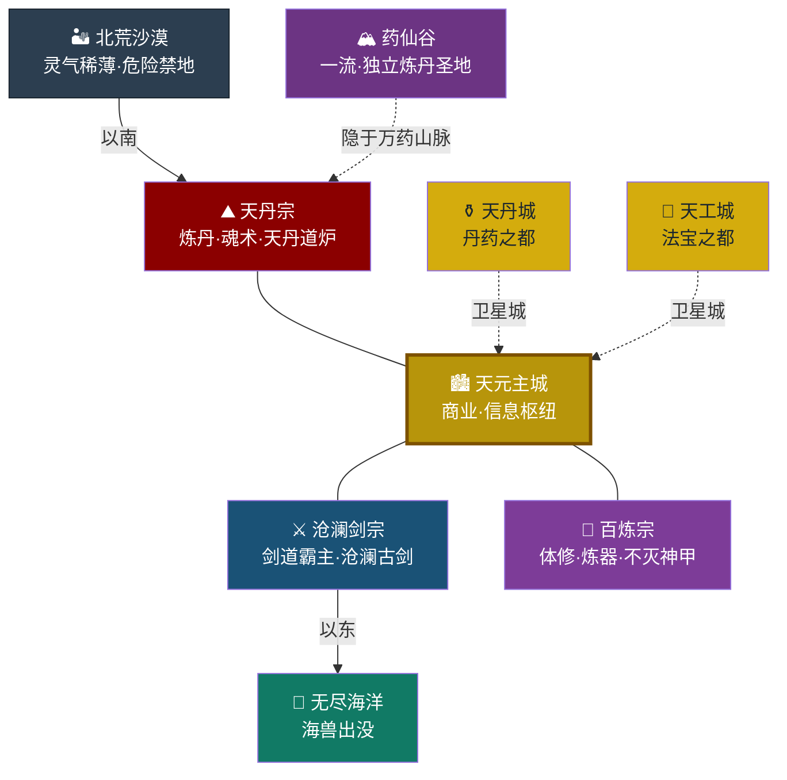

# 天渊大陆

## 大陆总览

### 大陆格局
- 主体陆地呈不规则三角形，三大顶级宗门各占一角，天元城位于中心
- 北方为广袤的北荒沙漠，气候极端，灵气稀薄，鲜有人迹
- 东部和南部被无尽海洋环绕，深海未知，偶有海兽侵袭
- 大陆之外皆是无边际的海洋或荒漠，至今无人探索到尽头

#### 大陆方位简图

> **方位要点**：三大宗门呈三角分布——**东**域沧澜剑宗（红）、**南**域百炼宗（紫）、**北**域天丹宗（深红）；**天元城市群**居中（金框），是三方制衡中立枢纽；北荒沙漠横亘北方（灰黑），无尽海洋环绕东南（青绿）；药仙谷隐于万药山脉深处。

### 势力层级
- **顶级势力**：三大宗门（沧澜剑宗、百炼宗、天丹宗）
- **一流势力**：5大家族 + 5大组织（炼丹师工会、炼器师工会、天渊商会、暗影阁、万兽宗）+ 药仙谷
- **二流势力**：散修联盟、飘渺剑派、各地区中小型宗门联盟、中等家族
- **三流势力**：地方豪强、散修团体、凡人势力

### 势力边界
- 三大势力版图以核心区域为界，边缘有模糊地带，没有绝对的分割线
- 地域划分以修炼主流和附属势力为主，普通人可在本地域内自由往来，但极少跨区域
- 修仙者跨势力往来需通过传送阵，大陆广袤使得直接飞行极为耗时（从一域到另一域需数月甚至数年）
- 势力边缘地带常有争端，但三大宗门保持克制，以协商解决为主

### 大陆传说
- **天渊**：相传大陆中央有一道贯通天地的深渊，名为天渊，是天地灵气的源泉，天元城即建在天渊上方。天元城地下的天渊秘境据传说与天渊相连
- **太古遗迹**：传说大陆各处散落着太古时期的遗迹，蕴含着强大的传承，秘境多为太古遗迹所化
- **外来者**：天丹宗的外来祖先来历成谜，是大陆最大的未解之谜。相传他们来自天渊大陆之外的世界，通过世界裂隙来到此地

---

## 三大顶级宗门

### 东域·沧澜海岸

**宗门：** 沧澜剑宗

**地貌：**
- 东部沿海平原与丘陵交错
- 海岸线绵长，多港湾、岛屿、礁石
- 近海有珊瑚礁群，远海深不可测
- 内陆有连绵的剑脊山脉，山峰陡峭如剑

**资源：**
- 近海盛产灵贝、珍珠等水系材料
- 海岸悬崖上有奇石矿脉，适合锻造飞剑
- 海洋中蕴含浓郁的水属性灵气
- 剑脊山脉中有珍稀金属矿脉

**修炼特色：**
- 主流：剑道、水系功法
- 兼修：基础体术、防御法术
- 特色：擅长海战、御剑飞行、水遁术

**重要地点：**
- **剑峰总坛**：建在临海悬崖之上，七座剑峰直指苍穹，主峰名为"沧澜"
- **镇海防线**：沿海岸线修建的防御工事，抵御海兽侵袭，每隔百里设有烽火台
- **剑冢**：历代剑修陨落之地，蕴含浓郁剑意，传闻有上古剑圣的传承。剑冢深处即为剑冢秘境，是上古剑圣陨落时留下的空间
- **无名岛**：近海神秘岛屿，相传是世界裂隙所在，岛上有古老的传送阵遗迹
- **剑脊山脉**：宗门腹地，有多处试炼秘境和资源矿脉
- **潮汐阁**：宗门藏书楼，收藏大量剑道典籍和水系功法
- **铸剑坊**：宗门炼器场所，专门锻造飞剑和水系法宝

**海兽威胁：**
- 近海有低阶海兽，定期清理
- 远海有强大海兽，极少有人敢深入
- 不定期发生兽潮，需三大宗门联合抵御
- 传闻深海中有海兽之王，实力堪比人类顶尖强者

**附属势力：**
- 沿海各小城池：凡人城池，向宗门提供物资
- 林家：虽为一流势力之一，但与沧澜剑宗渊源极深，负责部分区域巡逻，在宗门事务中有一定话语权

---

### 南域·铁山平原

**宗门：** 百炼宗

**地貌：**
- 中部平原为主，河流纵横
- 南部有丘陵和小型山脉（铁脊山脉）
- 北部与天元城接壤，地势平坦开阔
- 地貌多样，适合多种资源产出

**资源：**
- 丰富的矿产资源，铁脊山脉有巨型灵石矿脉和金属矿脉，是整个大陆的主要矿石产地
- 平原上有肥沃的灵田，盛产谷物和灵草
- 河流水域蕴含充沛灵气

**修炼特色：**
- 主流：体修、炼器
- 兼修：火系功法（炼器之火偏爆裂刚猛，注重温度掌控）
- 特色：擅长近身搏斗、锻造法宝、阵法布置

**重要地点：**
- **铁山总坛**：位于平原中央的巨型山峰，依山而建，气势恢宏
- **天工坊**：宗门核心炼器场所，炉火终年不熄，分为内坊和外坊
- **演武场**：体修切磋竞技之地，设有各种试炼设施和擂台
- **矿脉区**：铁脊山脉大型灵石矿脉和金属矿脉所在地，有专门的采矿小队
- **锻造殿**：宗门核心炼器研究场所，只有核心弟子才能进入
- **淬体池**：用特殊药液和灵石布置的修炼场所，加速体修进度

**附属势力：**
- 李家：体修家族，世代联姻
- 邹家：炼器家族，负责锻造防具
- 平原各小城池：凡人城池，提供粮食和劳动力

---

### 北域·万药山脉

**宗门：** 天丹宗

**地貌：**
- 广袤连绵的山区，山峦起伏，云雾缭绕
- 山间多溪流瀑布，植被茂密，气候湿润
- 深处有妖兽巢穴，外围是凡人村落
- 北部与北荒沙漠接壤，地势逐渐升高

**资源：**
- 盛产各种灵草药材，是整个大陆的主要药材产地
- 山间有珍稀矿脉，产出炼丹辅助材料
- 妖兽种类繁多，内丹、皮毛等是重要炼丹原料
- 山泉中蕴含天然灵液，是炼丹的珍贵材料

**修炼特色：**
- 主流：炼丹术、魂术
- 兼修：火系功法（炼丹之火偏温润持久，注重火候控制）
- 特色：擅长驭兽、辨识草药、灵魂探查

**重要地点：**
- **万药总坛**：位于万药山脉主峰，云雾深处的悬空楼阁，名为"丹霄阁"
- **百草园**：宗门核心药园，种植珍稀灵草，有强大的护阵保护
- **炼魂塔**：魂术修炼圣地，镇压着上古魂兽残魂，共九层
- **北荒边界**：与沙漠交界处，设有防御阵和巡逻队
- **丹药房**：宗门炼丹场所，分为不同等级的丹房
- **驭兽峰**：专门驯养和研究妖兽的山峰

**妖兽分布：**
- 外围：低阶妖兽，适合弟子试炼
- 中部：中阶妖兽，有一定危险
- 深处：高阶妖兽，实力强大，极少有人敢深入
- 秘境：传说中有上古妖兽守护的遗迹

**附属势力：**
- 叶家：炼丹家族，不依附但有合作
- 山间凡人村落：以采药为生，向宗门提供药材

---

## 一流势力

### 五大修仙家族

**李家**
- 位置：铁山平原北部，靠近天元城
- 特色：体修传承家族，擅长拳脚功夫
- 与百炼宗关系密切，世代联姻
- 族中强者可担任百炼宗客卿
- 家族驻地：铁虎山庄，依山而建，有大型演武场

**叶家**
- 位置：万药山脉深处，隐世而居
- 特色：炼丹传承家族，独立性强
- 不依附天丹宗，但与药仙谷有合作
- 拥有多处私人药园，出产珍稀药材
- 家族驻地：百草居，隐蔽在山谷之中，有强大的迷阵保护

**林家**
- 位置：沧澜海岸内陆，靠近剑脊山脉
- 特色：剑修家族，祖上有人曾在沧澜剑宗担任长老
- 家族剑法自成一派，与沧澜剑宗剑法同源而异流
- 负责沧澜海岸部分区域的巡逻任务
- 家族驻地：青锋堡，建在山腰，俯瞰海岸

**萧家**
- 位置：天元城周边，势力遍布全城
- 特色：综合性家族，弟子可自由选择修炼方向
- 家族势力遍布天元城，商业实力雄厚
- 与各大势力都保持良好关系，是天元城的主要管理者之一
- 家族驻地：天元府邸，位于天元城中心区域

**邹家**
- 位置：铁山平原南部，靠近铁脊山脉
- 特色：炼器家族，祖传锻造技艺
- 与百炼宗合作密切，为宗门提供优质兵器
- 擅长锻造防御类法宝，是大陆公认的防具世家
- 家族驻地：金刚堡，靠近矿脉区，方便获取材料

---

### 五大独立组织

**炼丹师工会**
- 位置：天元城内，占据城东区域
- 特色：炼丹师聚集组织，不依附任何势力
- 制定炼丹师等级标准，举办炼丹大赛
- 拥有专属药材仓库和炼丹试验场
- 内设：丹道学堂、药材交易所、炼丹大赛会场

**炼器师工会**
- 位置：天元城内，占据城西区域
- 特色：炼器师聚集组织，与炼丹师工会地位相当
- 制定炼器师等级标准，举办炼器大赛
- 拥有专属矿石仓库和炼器工坊
- 内设：器道学堂、矿石交易所、炼器大赛会场

**天渊商会**
- 位置：天元城中心，总部为聚宝阁
- 特色：大陆最大商会，富可敌国，垄断主要贸易
- 经营灵石、丹药、法宝、材料等所有修炼资源
- 内设：聚宝阁拍卖行、跨区域贸易网络、情报部
- 地位：中立势力，与各大势力均有合作

**暗影阁**
- 位置：隐藏在暗处，总部未知
- 特色：大陆最神秘的杀手组织，接单杀人，从不失手
- 规则：不接针对三大宗门核心人物的单子，不杀无辜
- 内设：暗杀部、情报部、赏金任务部
- 地位：令人闻风丧胆，各大势力既忌惮又利用

**万兽宗**
- 位置：万药山脉与铁山平原交界处的万兽城
- 特色：大陆最强大的驭兽宗门，以驯兽为主，人兽配合战斗
- 拥有大量妖兽，驯兽体系完善
- 内设：驯兽堂、兽兵营、炼兽阁
- 与天丹宗关系：提供妖兽材料，换取丹药

### 特殊一流势力

**药仙谷**
- 位置：万药山脉深处秘境入口处，独立于天丹宗之外
- 特色：独立炼丹圣地，传说有上古炼丹传承，历史甚至比天丹宗更为悠久
- 谷中种植大量珍稀古药，拥有独特的培育方法，部分药材为谷中独有
- 谷主神秘莫测，极少与外界接触，与天丹宗保持距离但非敌对
- 谷内有：药园、丹炉殿、传承殿
- 与天丹宗关系：互不干涉，偶有药材交易，天丹宗弟子不得擅入
- 地位：一流势力，凭上古传承与独有药材守住基业，连天丹宗也不敢轻视

### 二流势力（代表性）

**散修联盟**
- 位置：天元城及周边，总部设在天元城南区
- 特色：无宗门修士的组织，势力松散但人数众多
- 为散修提供信息、资源交换、庇护等服务
- 在天元城有专门的散修客栈和交易场所
- 内设：散修客栈、信息发布处、资源交易所

**飘渺剑派**
- 位置：沧澜海岸深处孤岛（飘渺岛）
- 特色：神秘剑修门派，剑法飘逸难以捉摸
- 门派弟子行踪不定，极少参与大陆事务
- 剑法注重速度和灵活性，与沧澜剑宗风格迥异
- 岛内有：剑庐、试炼场、隐秘的传送阵

**三大区域联盟**：东域联盟、南域联盟、北域联盟（详见势力架构）

---

## 中央枢纽·天元城市群

**地位：** 三大宗门及一流势力公认的中立商贸城市群，不属于任何势力，是大陆经济、文化、信息的核心枢纽

**地理位置：**
- 三大势力版图交汇处，是天然的地理中心
- 由天元主城、天丹城、天工城三座核心城池及周边卫星小镇组成
- 四周有平原和低山环绕，易守难攻
- 城南有一条大河（天河）穿过，提供水源和交通便利

**城市群架构：**

### 天元主城
- **定位**：商业核心、金融中心、信息枢纽
- **特色**：大陆最繁华的商业城市，居民来自各大势力，文化交融
- **管理者**：萧家联合商会管理城市事务
- **城市分区**：内城和外城，内城是核心区域
- **主要功能**：
  - **交易坊市**：综合交易市场，出售各种修炼资源、材料、功法秘籍
  - **拍卖会**：天渊商会聚宝阁所在地，定期举办大型拍卖会
  - **信息交流**：各大势力的消息集散地
  - **传送阵枢纽**：连接三大宗门及各大一流势力的传送阵所在地
  - **修炼交流**：各大势力弟子切磋交流的场所
- **重要地点**：
  - **天元坊市**：规模最大的综合交易市场
  - **聚宝阁**：顶级拍卖会举办地，每月举办一次大型拍卖会
  - **传送广场**：各大势力传送阵交汇处，设有防护阵
  - **商会总部**：管理城市的中立机构，由萧家主持
  - **散修客栈**：散修联盟在天元主城的据点，提供住宿和交易
  - **天酒楼**：城中最高级的酒楼，是各方势力人士聚集的场所
  - **天河码头**：城南码头，用于物资运输和人员往来

### 天丹城（卫星城）
- **定位**：丹药之都、药材交易中心、炼丹师圣地
- **特色**：整座城池围绕炼丹师工会建造，空气中常年弥漫着药香
- **管理者**：炼丹师工会主导，商会辅助
- **主要功能**：
  - **丹药交易**：大陆最大的丹药和药材交易市场
  - **炼丹师认证**：炼丹师等级考核与认证中心
  - **万药大会**：每五年举办一次大陆炼丹大赛
- **重要地点**：
  - **炼丹师工会总部**：城池核心区域，有九层丹塔
  - **万药坊市**：专售药材和丹药的大型市场
  - **丹塔广场**：炼丹大赛举办场地
  - **百草园分园**：天丹宗在城中设立的药园

### 天工城（卫星城）
- **定位**：法宝之都、矿石交易中心、炼器师圣地
- **特色**：整座城池围绕炼器师工会建造，昼夜炉火不息，锻造声不绝于耳
- **管理者**：炼器师工会主导，商会辅助
- **主要功能**：
  - **法宝交易**：大陆最大的法宝和矿石交易市场
  - **炼器师认证**：炼器师等级考核与认证中心
  - **天工大会**：每五年举办一次大陆炼器大赛
- **重要地点**：
  - **炼器师工会总部**：城池核心区域，有巨型炼器炉
  - **天工坊市**：专售法宝和矿石的大型市场
  - **铁炉广场**：炼器大赛举办场地
  - **矿务分堂**：百炼宗在城中设立的矿石管理机构

**城市群规则：**
- 禁止在城内动手斗殴，违者由执法队严惩
- 城内交易需缴纳一定比例的税费
- 各大势力在城内设有驻点，但不得携带大量武装人员
- 城市由商会和执法队共同管理，执法队由各大势力轮流派人组成
- 三城之间有传送阵连接，往来便利

---

## 大陆边界

### 北荒沙漠
- 位于万药山脉以北，广袤无垠，东西横跨数万里
- 气候极端，昼夜温差极大，白日酷热如焚，夜晚严寒刺骨
- 灵气稀薄，生存条件恶劣，极少有生物存活
- 沙漠中有流沙陷阱和诡异的幻境，极易迷失方向
- 传说深处有上古遗迹或神秘生物，但无人证实
- 沙漠边缘有一些小型绿洲，是冒险者的补给点

### 无尽海洋
- 环绕东域和南域，无边无际，深不可测
- 近海相对安全，有渔民和商船活动
- 远海危险重重，有强大海兽和诡异的海域
- 海兽等级随深度增加而提升
- 传说深海中有古代遗迹和神秘种族
- 无人知晓海洋尽头是什么
- 海域中有一些神秘岛屿，有的是妖兽巢穴，有的是天然秘境

---

## 交通与传送

### 传送阵网络
- **三大宗门-天元城**：双向传送阵，是主要交通方式，传送一次需消耗大量灵石
- **一流势力-天元城**：各势力与天元城间有传送阵
- **宗门内部**：各附属势力间有小型传送阵
- **特殊传送**：秘境、禁地有专属传送阵，需特定条件才能激活
- **传送阵等级**：分为普通传送阵（短距离）、大型传送阵（跨区域）、超大型传送阵（大陆级）

### 飞舟航线
- 主要用于短距离交通和物资运输
- 远距离仍需传送阵
- 有专门的飞舟驿站，提供飞舟租赁和维修服务

### 世界裂隙
- **无名岛裂隙**：主角进入天渊大陆的入口，位于沧澜海岸近海
- **祠堂裂隙**：连接现实世界五华祠堂的神秘通道，不稳定，时有时无
- 裂隙开启条件未知，可能与特定时间、特定人物有关

### 危险区域
- **死亡海域**：沧澜海岸以东千里之外，海兽横行，极少有人能穿越
- **迷失沙漠**：北荒沙漠中部，有强大的幻境，进入者十死无生
- **妖雾沼泽**：万药山脉与铁山平原交界处，有剧毒沼泽和强大妖兽
- **碎星崖**：沧澜海岸最南端的悬崖，海浪滔天，有神秘力量

---

## 资源产地

### 灵石矿脉
- 铁山平原（铁脊山脉）：产量最大，品质中等，是大陆主要灵石来源
- 万药山脉：品质较高，产量较少，蕴含特殊属性灵石
- 沧澜海岸：海底矿脉，开采难度大，品质极高
- 北荒沙漠：传说有高品质灵石矿脉，但难以开采

### 灵药产地
- 万药山脉：种类最丰富，是主要供应地
- 铁山平原：平原灵草，产量稳定
- 沧澜海岸：海水灵草，独特品种
- 药仙谷：珍稀古药，独有品种，不对外出售
- 北荒沙漠边缘：有一些耐旱的珍稀药材

### 特殊材料产地
- 万药山脉：妖兽内丹、皮毛、骨骼
- 沧澜海岸：海兽材料、珍珠、珊瑚、深海矿石
- 铁山平原（铁脊山脉）：金属矿石、稀有矿物、灵木

---

## 特殊区域

### 秘境

**万药秘境**
- 位置：万药山脉深处
- 特点：生长珍稀古药，有强大守护妖兽
- 开启条件：每百年开启一次，需特定令牌进入
- 内部有：药园、炼丹传承、上古妖兽巢穴

**剑冢秘境**
- 位置：沧澜剑宗剑冢深处
- 特点：蕴含上古剑意传承，有历代剑修的遗留
- 开启条件：每年开启一次，仅限宗门弟子进入
- 内部有：剑意试炼、飞剑传承、上古剑修遗迹

**矿山秘境**
- 位置：百炼宗铁脊山脉矿脉深处
- 特点：有珍稀矿藏和古代遗迹
- 开启条件：不定期开启，需宗门批准
- 内部有：珍稀矿石、炼器传承、古代工坊遗迹

**天渊秘境**
- 位置：天元城地下深处，传说连接天渊
- 特点：蕴含浓郁灵气，有神秘的传承
- 开启条件：未知，可能与特定条件有关
- 内部有：灵气泉眼、神秘传承、未知危险

**飘渺秘境**
- 位置：飘渺岛深处
- 特点：神秘莫测，极少有人知晓
- 开启条件：仅限飘渺剑派弟子
- 内部有：剑法传承、神秘力量

---

### 禁地

**北荒禁区**
- 位置：北荒沙漠深处，无人能深入
- 特点：极度危险，有强大的神秘力量
- 传说：深处有上古遗迹或沉睡的神秘生物
- 进入者：从未有人活着回来

**深海禁区**
- 位置：无尽海洋深处，海兽之王领地
- 特点：海兽实力强大，海域诡异
- 传说：深处有古代遗迹或海底文明
- 进入者：极少有人敢深入，几乎无人能返回

**炼魂塔九层**
- 位置：天丹宗炼魂塔最高层
- 特点：镇压着上古魂兽残魂，极为危险
- 传说：顶层有魂术终极传承
- 进入者：仅限天丹宗核心弟子，需长老陪同

**剑峰禁地**
- 位置：沧澜剑宗主峰沧澜峰顶端
- 特点：有强大的剑意压制，非剑道强者无法接近
- 传说：顶端有上古剑圣的传承
- 进入者：仅限宗门核心弟子

---

### 世界裂隙点

**无名岛裂隙**
- 位置：沧澜海岸近海无名岛
- 特点：连接现实世界与天渊大陆的通道
- 状态：不稳定，时有时无，难以预测
- 传说：裂隙是天然形成的，可能与上古时期的某个事件有关

**祠堂裂隙**
- 位置：现实世界五华祠堂
- 特点：连接天渊大陆的神秘通道
- 状态：不稳定，可能需要特定条件才能激活
- 与主角关系：主角从这里进入天渊大陆

---

## 重要事件地点

**镇海之战遗址**
- 位置：沧澜海岸中段
- 历史：百年前三大宗门联合抵御大规模兽潮的战场
- 现状：成为沧澜剑宗弟子的试炼场所

**万药大会会场**
- 位置：天元城北区
- 功能：每五年举办一次的炼丹大赛会场
- 意义：大陆炼丹师展示实力的舞台

**炼器大赛会场**
- 位置：天元城西区
- 功能：每五年举办一次的炼器大赛会场
- 意义：大陆炼器师展示实力的舞台

**宗门大比场地**
- 位置：天元城中心广场
- 功能：每十年举办一次的宗门大比
- 意义：三大宗门展示实力和交流的重要场合