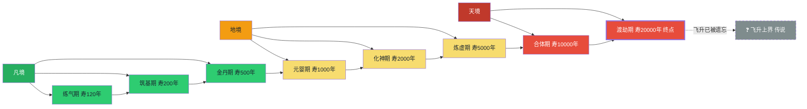
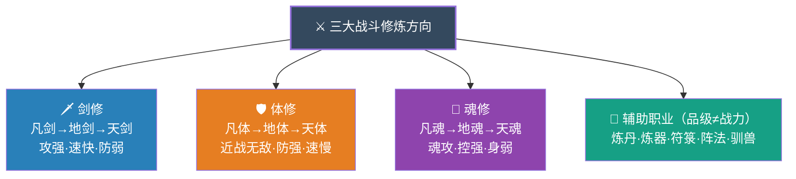

# 修炼体系

## 世界设定说明

### 天渊之谜

天渊大陆的格局，已延续了无数岁月。对于这片大陆的来历与形成，除了最顶层的一小批存在，几乎无人知晓，也无人关心。大陆上流传的零星传说，大多支离破碎，真伪难辨。

**被遗忘的传说**
- 关于"飞升"，早已成为近乎被遗忘的远古传说。只有极少数古籍残卷中，还记载着模糊的只言片语
- "天渊之战"这个名字，在当代修士的认知中，不过是一个遥远的神话符号，如同凡人世界的创世传说
- 绝大多数修士根本不知道，天渊大陆曾经是一个被流放、被封印的世界，这片天地的规则与外界截然不同
- 当代修士普遍认为，修炼到渡劫期便是终点，所谓"飞升上界"不过是古人的虚妄幻想

**当代认知**
- 渡劫期被公认为修炼的终点，能达到此境界者，已是天地间的巅峰存在
- 渡劫期强者可调用天地之力，翻江倒海，掌控一方天地，足以令整个大陆敬畏
- 即便是渡劫期修士，也早已不再寻求"证道飞升"。对他们而言，渡劫期便是圆满，再无更高追求
- 所谓"上界"，在当代修士心中，不过是古籍中的浪漫想象，如同凡人仰望星空时的臆想

**真相的守护者**
- 只有各大顶级势力的老祖、传承久远的上古家族族长，才知晓部分残缺的真相
- 天渊大陆是一个被封印的世界，飞升之路被阻断，天地规则残缺不全
- 这个秘密被严格保守，因为一旦泄露，可能会引发整个大陆的恐慌与混乱
- 绝大多数修士活在"渡劫即终点"的认知中，心安理得地享受着修炼带来的力量与长生

**异类的梦想**
- 在这样的世界里，任何追求"打破天地桎梏"的想法，都会被视为荒诞不经的妄想
- 那些敢于质疑"渡劫即终点"的人，往往被视为疯子或不知天高地厚的蠢货
- 陆渊，一个出身平凡的小修士，却怀揣着打破天地桎梏的梦想，在这个世界中，注定是一个异类
- 他的梦想，在旁人眼中如同痴人说梦，如同凡人妄想一步登天般不切实际

### 天渊至宝——远古秘辛

天渊之战早已成为近乎被遗忘的传说，但在极少数顶级势力的秘典中，仍记载着一些关于那场浩劫的零星碎片。传说战后在天地规则的孕育下，诞生了四件超越凡俗的神器——**天渊至宝**。

这个秘密被严格保守，只有各大顶级势力的老祖、传承久远的上古家族族长，才知晓部分残缺的真相。

**四件至宝**（仅存于古籍中的记载）
- **沧澜古剑**：攻击至宝，藏于沧澜剑宗，完整度约七成，需渡劫期才能完全催动，可斩断天地法则
- **不灭神甲**：防御至宝，藏于百炼宗，完整度约六成，攻防兼备，可反弹八成伤害
- **天丹道炉**：毁灭至宝，藏于天丹宗，完整度约五成，可熔炼天地万物，对外伪装为炼丹至宝
- **混沌塔**：本源至宝，原本为九层神塔，天渊之战中被彻底摧毁，只剩残骸。陆家祖上将其带到华夏，世代供奉于祠堂之中，至今已有数千年。完整度约四成（仅剩六层），第七至第九层已湮灭。先祖曾修复六层，但关于此塔的更多来历与使命，陆家世代知之甚少

**太古传闻**：四件天渊至宝原本是一体，名为"天渊造化盘"，是天地初开时孕育的至宝。天渊之战中，天渊造化盘被击碎，化作四件至宝散落大陆。其中混沌塔受损最为严重，第七至第九层彻底湮灭，无法修复。

**残缺真相**（仅极少数人知晓）
- 沧澜古剑：由沧澜剑宗世代守护，完整度约七成
- 不灭神甲：由百炼宗世代守护，完整度约六成
- 天丹道炉：由天丹宗世代守护，完整度约五成
- **混沌塔**：本源至宝，天渊之战中受损严重，第七至第九层彻底湮灭。陆家祖上将其带到华夏，世代供奉于祠堂之中，至今已有数千年。关于此塔的更多来历与使命，陆家世代知之甚少

**三大宗门至宝**（宗门内部秘辛）
- **沧澜剑宗**：持有沧澜古剑，世代传承，是宗门立足的根本
- **百炼宗**：持有不灭神甲，世代传承，是宗门的核心战力
- **天丹宗**：持有天丹道炉，世代传承，对外伪装为炼丹至宝，实为毁灭大杀器

**飞升之秘**（仅存于最古老的秘典中）：传说当四件至宝齐聚并修复后，可重铸天渊造化盘，届时将有能力打破天地桎梏。这或许就是天渊大陆无人能突破渡劫期的真正原因——缺少了天渊造化盘的支撑，天地无法承载超越渡劫期的力量。而混沌塔的残缺，更是关键中的关键。

**至宝制衡**：四件至宝各有所长又相互克制：沧澜古剑主攻伐但门槛最高，不灭神甲主防御且攻防兼备，天丹道炉主毁灭且威慑最大，混沌塔潜力无限但已残缺。完整状态下威力排序：天丹道炉 > 沧澜古剑 > 不灭神甲 > 混沌塔

**修复条件**：据传可通过集齐其他三件至宝的力量来修复混沌塔第七至第九层，重铸完整的天渊造化盘。但这只是古籍中的记载，当代无人验证其真实性。

### 世界边界

- 大陆之外是无边际的海洋与北荒沙漠，至今无人探索到尽头
- 深海有强大海兽，曾有渡劫期强者探索深海，再未归来
- 北荒沙漠深处有未知危险，传闻比深海更加恐怖
- 这个世界远比人们想象的要大得多，也危险得多

---

## 境界划分

#### 境界体系总览图

> **说明**：境界分**凡/地/天**三境，每境含若干小境界，各分前/中/后/圆满。当代修士公认"渡劫即终点"，飞升仅为远古传说。三大战斗方向（剑/体/魂）是主流，辅助职业品级仅代表技艺水平不代表战力。

### 凡境

**练气期**
- 等级：前期 / 中期 / 后期 / 圆满
- 寿命：约120年
- 实力描述：引天地灵气入体，淬炼肉身，初步掌握灵气运用。力量远超常人，可轻松对付数十名凡人
- 突破条件：积累足够灵气，打通十二正经
- 修炼资源需求：下品灵石、基础灵草
- 常见术法：基础御风术、火球术、水箭术等基础元素术法
- 代表人物：各大宗门外门弟子

**筑基期**
- 等级：前期 / 中期 / 后期 / 圆满
- 寿命：约200年
- 实力描述：将灵气凝聚成液态，在丹田形成灵海，可御器飞行。灵气量大幅提升，能施展更复杂的术法
- 突破条件：灵海凝聚到极致，冲击丹田壁障，形成筑基印记
- 修炼资源需求：中品灵石、筑基丹、淬体液
- 常见术法：御剑术、御风术、基础阵法、低级符箓
- 代表人物：各大宗门内门弟子、三流势力核心

**金丹期**
- 等级：前期 / 中期 / 后期 / 圆满
- 寿命：约500年
- 实力描述：将液态灵气凝聚成固态金丹，金丹蕴含磅礴灵气。可分神出窍，神识大幅增强，能炼制中品丹药和法宝
- 突破条件：灵海压缩至极限，经历第一次天劫洗礼
- 修炼资源需求：上品灵石、金丹丹、灵乳、珍惜材料
- 常见术法：神识探查、分神术、中阶阵法、御器飞行
- 代表人物：各大宗门核心弟子、二流势力长老

---

### 地境

**元婴期**
- 等级：前期 / 中期 / 后期 / 圆满
- 寿命：约1000年
- 实力描述：金丹碎裂，孕育出元婴。元婴可离体而出，拥有独立意识，实力相当于本体七成。可炼制上品丹药和法宝
- 突破条件：金丹圆满后引动天劫，天劫淬炼下化出元婴
- 修炼资源需求：极品灵石、元婴丹、元婴果、顶级材料
- 常见术法：元婴离体、神识攻击、高阶阵法、空间感知
- 代表人物：一流势力核心、三大宗门长老

**化神期**
- 等级：前期 / 中期 / 后期 / 圆满
- 寿命：约2000年
- 实力描述：元婴与肉身完美融合，可化身为神，掌控天地法则。能撕裂空间，短距离瞬移，炼制极品丹药和法宝
- 突破条件：元婴圆满后感悟天地法则，经历第二次天劫
- 修炼资源需求：仙灵石、化神丹、法则感悟、天地灵物
- 常见术法：法则之力、空间瞬移、领域初成、魂术攻击
- 代表人物：三大宗门太上长老、一流势力族长

**炼虚期**
- 等级：前期 / 中期 / 后期 / 圆满
- 寿命：约5000年
- 实力描述：领悟空间法则，可随意穿梭空间，开辟独立空间。领域完全成型，实力远超化神期
- 突破条件：化神圆满后领悟空间法则真谛，经历第三次天劫
- 修炼资源需求：顶级仙灵石、炼虚丹、空间本源、天地至宝
- 常见术法：空间穿梭、领域压制、法则神通、灵魂攻击
- 代表人物：三大宗门宗主、传说中的隐世强者

---

### 天境

**合体期**
- 等级：前期 / 中期 / 后期 / 圆满
- 寿命：约10000年
- 实力描述：肉身与元婴完美合一，达到天人合一之境。可小范围调动天地之力，实力远超炼虚期
- 突破条件：炼虚圆满后完成肉身与元婴的最终融合，经历第四次天劫
- 修炼资源需求：天地本源、合体丹、极致感悟
- 常见术法：天地之力、分身术、灵魂分身、领域融合
- 代表人物：大陆已知巅峰强者，据传当世仅数人达到此境界

**渡劫期**
- 等级：前期 / 中期 / 后期 / 圆满
- 寿命：约20000年
- 实力描述：感悟天地法则极致，可大范围调用天地之力。举手投足间可毁城灭国，是此方世界公认的修炼终点。无人再追求所谓的"飞升"，渡劫期便是圆满之境
- 突破条件：合体圆满后感悟天地法则极致，经历第五次天劫
- 修炼资源需求：天地至宝、极致感悟
- 常见术法：天地之力极致运用、法则融合、天地法则掌控
- 代表人物：大陆最顶级的存在，当世仅有寥寥数人，隐于各大顶级势力之中

---

## 三大战斗修炼方向

### 剑修

**境界称呼**
- 凡境：凡剑
- 地境：地剑
- 天境：天剑

**核心能力**
- 剑气外放：筑基期可释放剑气，金丹期剑气可凝形，元婴期剑气可化形攻击
- 剑意：金丹期领悟剑意，元婴期剑意化形，化神期凝剑域，炼虚期剑域圆满
- 御剑飞行：筑基期可御使灵剑飞行，元婴期可御剑长途奔袭
- 人剑合一：化神期后可与剑融为一体，合体期可剑化真身
- 剑道法则：炼虚期领悟剑道法则，渡劫期剑道法则圆满

**攻击特点**
- 攻击力强，速度快
- 擅长远程攻击和点杀
- 防御较弱，需靠身法闪避
- 剑意可破万法，无视部分防御

**修炼方式**
- 以剑入道，注重悟性和剑意领悟
- 需不断磨砺剑法，与剑产生共鸣
- 剑道越纯粹，攻击力越强

**代表功法**：沧澜剑宗《沧澜剑诀》、飘渺剑派《飘渺剑法》、林家《万剑归宗》

---

### 体修

**境界称呼**
- 凡境：凡体
- 地境：地体
- 天境：天体

**核心能力**
- 肉身强悍：炼皮→炼肉→炼骨→炼脏→炼髓→炼血→炼魂
- 力量巨大：练气期可举千斤，筑基期可撼山岳，金丹期可碎星辰
- 恢复能力强：肉身自愈能力远超常人，可快速恢复伤势
- 防御惊人：可硬抗法宝攻击，高阶体修肉身堪比极品法宝
- 体术神通：化神期可领悟体术法则，炼虚期可施展体术神通

**攻击特点**
- 近战无敌，爆发力强
- 擅长以力破巧，以硬碰硬
- 速度较慢，需靠近敌人
- 肉身攻击可破护身法术

**修炼方式**
- 以身为炉，锤炼肉身
- 需承受极限痛苦，不断突破肉身极限
- 高阶体修可将法则融入肉身

**代表功法**：百炼宗《铁骨金身诀》、李家《金刚不坏神功》、叶家《九转玄功》

---

### 魂修

**境界称呼**：魂修的修士境界与大众一致（练气→筑基→…→渡劫），其战力取决于"魂力等级"，详见后文"魂力等级体系"。

**核心特点**
- 以魂入道，战力核心是魂力等级而非修为境界
- 同境魂修对上同境非魂修，胜负取决于双方魂力与肉身防御的博弈
- 肉身较弱，需靠魂术防御和身法保护自身

**代表功法**：天丹宗《炼魂经》、林家《镇魂印》、散修联盟《魂天诀》

---

## 功法等级体系

### 等级划分

功法分为三大等级，每级分三阶，对应修炼者境界：

| 等级 | 对应境界 | 说明 |
|------|----------|------|
| 凡级 | 凡境（练气/筑基/金丹） | 凡人可修炼的功法，提升修为速度有限 |
| 地级 | 地境（元婴/化神/炼虚） | 蕴含法则之力，提升修为速度大幅增加 |
| 天级 | 天境（合体/渡劫） | 蕴含天地法则，提升修为速度逆天 |

### 功法与武技的区别
- **功法**：修炼根基，决定修炼速度和潜力，是修士的根本
- **武技**：战斗招式，决定战斗能力，是修士的手段
- **关系**：功法为体，武技为用；没有强大的功法支撑，武技威力难以发挥；没有精湛的武技配合，功法修为无法有效转化为战力

### 凡级功法

**凡级功法**为基础功法，凡境修士可修炼，是修士初期修炼的主要功法。

**凡级下阶**
- 效果：可引导灵气入体，奠定修炼基础
- 适合：练气期
- 代表：《吐纳诀》《基础心法》《引气诀》

**凡级中阶**
- 效果：可凝练内劲，筑基成功，修炼速度提升
- 适合：筑基期
- 代表：《筑基诀》《混元功》《五行诀》

**凡级上阶**
- 效果：可凝聚金丹，修炼速度大增，凡境极致
- 适合：金丹期
- 代表：《金丹诀》《万象诀》《龙虎功》

### 地级功法

**地级功法**蕴含法则之力，地境修士可修炼，是大陆主流功法，修炼速度远超凡级。

**地级下阶**
- 效果：可凝聚元婴，领悟法则之力，修炼速度大幅提升
- 适合：元婴期
- 代表：《元婴诀》《沧澜剑诀》《百炼金身诀》

**地级中阶**
- 效果：可化神入道，法则之力凝实，修炼速度再次提升
- 适合：化神期
- 代表：《化神诀》《天丹真经》《碧海潮生诀》

**地级上阶**
- 效果：可炼虚合道，法则之力圆满，修炼速度达到极致
- 适合：炼虚期
- 代表：《炼虚诀》《焚天锻体术》《镇世诀》

### 天级功法

**天级功法**蕴含天地法则，天境修士可修炼，是大陆顶级功法，修炼速度逆天。

**天级下阶**
- 效果：可合体化一，调动天地之力，修炼速度逆天
- 适合：合体期
- 代表：《合体诀》《天地造化诀》《混沌诀》

**天级中阶**
- 效果：可渡劫悟道，天地之力运用自如，修炼速度再次提升
- 适合：合体期后期至渡劫期
- 代表：《渡劫诀》《天道诀》《万法归一诀》

**天级上阶**
- 效果：可领悟天地法则极致，修炼速度达到传说级别
- 适合：渡劫期
- 代表：《天渊造化诀》《飞升诀》《大道本源诀》

### 神级功法（传说）

**神级功法**是传说中的存在，远超天级功法，蕴含天道法则，可直指大道本源。

**传说描述**
- 据说神级功法是天地初开时自然孕育，或上古时期超越渡劫期的存在所创
- 神级功法可直接掌控天道法则，修炼者可直达天地法则极致
- 当代大陆已无神级功法传承，仅在古籍中有零星记载
- 神级功法的修炼条件苛刻至极，需领悟天地法则极致才能修炼

**传说代表**
- 《天渊造化盘》：据说可创造世界，演化万物
- 《大道本源诀》：据说可直达大道本源
- 《创世诀》：据说可创造新的天地

### 功法获取途径

- **宗门传承**：各大宗门藏经阁，等级越高越难获取
- **秘境探索**：上古遗迹、秘境中可能遗留功法传承
- **血脉传承**：某些家族拥有独特的血脉传承功法
- **奇遇获得**：机缘巧合下获得的传承或顿悟
- **自创功法**：顶级强者可根据自身领悟创造功法

---

## 武技等级体系

### 等级划分

武技分为三大等级，每级分三阶，对应修炼者境界：

| 等级 | 对应境界 | 说明 |
|------|----------|------|
| 凡级 | 凡境（练气/筑基/金丹） | 凡人可修炼的武技，威力有限 |
| 地级 | 地境（元婴/化神/炼虚） | 蕴含法则之力，需地境修为才能发挥 |
| 天级 | 天境（合体/渡劫） | 蕴含天地法则，需天境修为才能发挥 |

### 凡级武技

**凡级武技**为基础武技，凡境修士可修炼，是修士初期战斗的主要手段。

**凡级下阶**
- 威力：可增强肉身力量，比普通拳脚强数倍
- 适合：练气期
- 代表：基础剑法、基础拳法、基础刀法

**凡级中阶**
- 威力：可凝练内劲，形成简单招式
- 适合：筑基期
- 代表：旋风腿、裂山拳、流云剑

**凡级上阶**
- 威力：可引动少量灵气，招式威力大增，凡境极致
- 适合：金丹期
- 代表：金钢拳、破甲剑、烈焰掌、万剑归宗（凡级版）

### 地级武技

**地级武技**蕴含法则之力，地境修士可修炼，是大陆主流武技，威力远超凡级。

**地级下阶**
- 威力：可引动法则之力，威力远超凡级
- 适合：元婴期
- 代表：幻影剑法、金刚不坏体、噬魂术

**地级中阶**
- 威力：法则之力凝实，可形成领域雏形
- 适合：化神期
- 代表：沧澜七剑、百炼拳、炼魂术

**地级上阶**
- 威力：法则之力圆满，领域成型，可毁城灭国
- 适合：炼虚期
- 代表：一剑破万法、铁山崩、天魂术、潮汐剑法、金身不破

### 天级武技

**天级武技**蕴含天地法则，天境修士可修炼，是大陆顶级武技，威力逆天。

**天级下阶**
- 威力：可调动天地之力，举手投足间毁城灭国
- 适合：合体期
- 代表：天地一剑、万劫不灭、轮回魂

**天级中阶**
- 威力：天地之力运用自如，可撕裂空间
- 适合：合体期后期
- 代表：断云裂空、百炼金刚、灵魂分身

**天级上阶**
- 威力：天地法则领悟极致，可创造法则领域，传说中可改写天地法则
- 适合：渡劫期
- 代表：万剑臣服、八反甲、熔炼天地、一剑斩天、造化万法

### 神级武技（传说）

**神级武技**是传说中的存在，远超天级武技，蕴含天道法则，可改天换地。

**传说描述**
- 据说神级武技是上古时期超越渡劫期的存在所创
- 神级武技可直接掌控天道法则，举手投足间可覆灭星辰
- 当代大陆已无神级武技传承，仅在古籍中有零星记载
- 神级武技的修炼条件苛刻至极，需领悟天地法则极致才能修炼

**传说代表**
- 《天渊轮回诀》：可逆转时空，轮回转世
- 《造化万法诀》：可创造万物，演化法则
- 《一剑斩天诀》：一剑斩破天地，直达本源

### 武技获取途径

- **宗门传承**：各大宗门藏经阁，等级越高越难获取
- **秘境探索**：上古遗迹、秘境中可能遗留武技传承
- **拍卖购买**：天渊商会等商会可能拍卖武技秘籍
- **奇遇获得**：机缘巧合下获得的传承或顿悟
- **自创武技**：顶级强者可根据自身领悟创造武技

---

## 妖兽等级体系

### 等级划分

妖兽分为四大等级，每一等级可细分为三阶（初期/中期/后期）。

**对应说明**：妖兽肉身天赋各异，无法与修士境界精确一一对应。仅"大级别"与修士"大境界"大致对应，大级别内的初/中/后各大致对应修士的一个大境界，**无更细的对应关系**。具体妖兽实际战力以肉身天赋、血脉、法则领悟为准。

| 妖兽大级别 | 对应修士大境界 | 初/中/后大致对应 | 说明 |
|------------|---------------|------------------|------|
| **凡兽** | 凡境 | 练气 / 筑基 / 金丹 | 无灵智或灵智低下，以本能行动 |
| **灵兽** | 地境 | 元婴 / 化神 / 炼虚 | 开启灵智，可化形或口吐人言 |
| **地兽** | 天境 | 合体 / 渡劫 / 渡劫巅峰 | 灵智成熟，可掌控部分法则之力 |
| **天兽** | 天境巅峰（渡劫后期~渡劫巅峰） | 极其稀少，几乎不存于世 | 灵智堪比人类，可化为人形，掌控天地法则 |

### 凡兽

**凡兽**为最低等级妖兽，无灵智或灵智低下，以本能行动，是修士初期的主要猎物。

**凡兽初期**
- 大致对应：练气期
- 特点：体型较小，力量较弱，无灵智
- 代表：青狼、赤虎、灵蛇、火狐

**凡兽中期**
- 大致对应：筑基期
- 特点：体型中等，力量较强，有微弱灵智
- 代表：铁甲熊、疾风豹、毒蝎、雷鹰

**凡兽后期**
- 大致对应：金丹期
- 特点：体型较大，力量强大，灵智初开
- 代表：金刚猿、烈焰狮、碧水龙、暗影狐

### 灵兽

**灵兽**为进阶妖兽，开启灵智，可说话可化形，是大陆常见的中阶妖兽。

**灵兽初期**
- 大致对应：元婴期
- 特点：灵智开启，可说话可化形为人形，力量强大
- 代表：九尾狐、麒麟幼崽、凤凰幼崽、龙龟

**灵兽中期**
- 大致对应：化神期
- 特点：灵智成熟，化形更加稳定，掌握基础法则
- 代表：千年树妖、冰霜巨蟒、雷霆战象、幽冥鬼蝠

**灵兽后期**
- 大致对应：炼虚期
- 特点：化形完美无瑕，可自由切换形态，掌握多种法则，实力强大
- 代表：玄武、朱雀、青龙、白虎（幼年期）

### 地兽

**地兽**为高阶妖兽，灵智成熟，可掌控部分法则之力，是大陆顶级妖兽。

**地兽初期**
- 大致对应：合体期
- 特点：灵智堪比人类，可化为人形，掌握法则之力
- 代表：远古地龙、金翅大鹏、冰凤、炎龙

**地兽中期**
- 大致对应：渡劫期
- 特点：法则之力运用自如，可开辟领地，建立兽群
- 代表：深海巨兽、北荒狼王、万药山脉守护兽、铁山矿脉守护兽

**地兽后期**
- 大致对应：渡劫期巅峰
- 特点：法则之力圆满，实力堪比渡劫期巅峰修士
- 代表：远古凶兽后裔、天渊海兽、北荒沙漠霸主

### 天兽

**天兽**为传说中的顶级妖兽，灵智堪比人类，可化为人形，掌控天地法则。对应天境巅峰（渡劫后期~渡劫巅峰），极其稀少，当代几乎不存于世。

**天兽初期**
- 大致对应：渡劫期后期
- 特点：可掌控天地之力，超越寻常渡劫期
- 代表：太古龙种、远古凤族、混沌巨兽（传说）

**天兽中期**
- 大致对应：渡劫期圆满
- 特点：天地之力运用自如，可撕裂空间
- 代表：天渊深渊守护兽、大陆边缘守护者（传说）

**天兽后期**
- 大致对应：渡劫期巅峰
- 特点：天地法则领悟极致
- 代表：天地孕育的神兽、上古大战遗留的凶兽（仅传说）

### 妖兽特殊分类

**妖兽血脉**
- **普通血脉**：常见妖兽，无特殊传承
- **远古血脉**：远古凶兽后裔，血脉中蕴含强大传承
- **神兽血脉**：传说中的神兽后裔，血脉中蕴含天地法则

**妖兽习性**
- **群居妖兽**：以族群形式生活，有等级制度
- **独居妖兽**：独自生活，领地意识强
- **智慧妖兽**：灵智极高，可与人类交流甚至合作

**妖兽价值**
- **材料价值**：兽皮、兽骨、兽血、兽丹等可用于炼器炼丹
- **战力价值**：可驯服为坐骑或战斗伙伴
- **研究价值**：高阶妖兽体内蕴含法则之力，对修炼有帮助

---

## 炼器师评级体系

### 核心说明

- **品级≠战力**：炼器师品级仅代表炼器技艺水平，不代表战斗实力。一个化神期的五品炼器师，战力取决于他的化神期修为，而非五品炼器水平
- 炼器师可同时是剑修、体修或魂修，炼器只是其职业技艺

### 境界限制说明

- 凡境（练气/筑基/金丹）：最高可炼制三品法器
- 地境（元婴/化神/炼虚）：最高可炼制六品法器
- 天境（合体/渡劫）：最高可炼制七品法器

### 炼器师等级

**一品炼器师**
- 能力：可炼制一品法器
- 对应境界：练气期
- 标志：可在法器上铭刻一道基础符文
- 特点：需借助外力引火，成功率约40%，法器无灵智

**二品炼器师**
- 能力：可炼制二品法器
- 对应境界：筑基期
- 标志：可铭刻三道基础符文，能炼制简单符箓
- 特点：可自身引火炼器，成功率约55%，法器可简单认主

**三品炼器师**
- 能力：可炼制三品法器，能刻画简单阵法
- 对应境界：金丹期
- 标志：可铭刻五道符文，刻画简单攻击阵法
- 称号：炼器师
- 特点：成功率约70%，法器可产生灵性，初步具备成长性

**四品炼器师**
- 能力：可炼制四品法器，能刻画中等阵法
- 对应境界：元婴期
- 标志：可铭刻八道符文，刻画中等攻防阵法
- 称号：炼器师
- 特点：成功率约80%，法器可孕育器灵，器灵可辅助战斗

**五品炼器师**
- 能力：可炼制五品法器，能刻画复杂阵法
- 对应境界：化神期
- 标志：可铭刻十二道符文，刻画复杂阵法
- 称号：炼器大师
- 特点：成功率约90%，法器器灵初具智慧，可自主护主

**六品炼器师**
- 能力：可炼制六品法器，能铭刻领域符文
- 对应境界：炼虚期
- 标志：可铭刻十八道符文，铭刻领域符文
- 称号：炼器大师
- 特点：成功率约98%，法器器灵拥有完整智慧，可化形而出

**七品炼器师**
- 能力：可炼制七品法器，能铭刻天地符文
- 对应境界：合体期/渡劫期
- 标志：可铭刻二十四道符文，铭刻天地法则符文
- 称号：炼器宗师
- 特点：成功率约95%，法器蕴含天地之力，可成长为通天灵宝
- 备注：据传当世能炼制七品法器的炼器师不超过三人

### 武器/法宝品级

**一品法器**
- 材质：普通金属矿石、劣质灵材
- 特点：蕴含微弱灵气，比凡铁锋利数倍，可轻微增幅灵气
- 适合：练气期修士
- 代表：青钢剑、铁骨盾、储物袋

**二品法器**
- 材质：蕴含灵气的矿石、低级灵材
- 特点：可注入灵气增强威力，具备简单属性加成，可认主
- 适合：筑基期修士
- 代表：烈焰刀、寒冰盾、飞行剑

**三品法器**
- 材质：灵铁矿、精金石、玄铜等
- 特点：可刻画简单阵法，有特殊效果（如破甲、吸血、增幅），具备成长性
- 适合：金丹期修士
- 代表：破阵枪、嗜血刃、聚灵环

**四品法器**
- 材质：寒铁精、玄金、星辰铁等珍稀材料
- 特点：可刻画中等阵法，威力较强，可孕育器灵，器灵可辅助战斗
- 适合：元婴期修士
- 代表：风雷剑、万象盾、魂印珠

**五品法器**
- 材质：天铁、魂金、龙鳞钢等顶级材料
- 特点：可刻画复杂阵法，有领域效果，器灵初具智慧，可自主战斗
- 适合：化神期修士
- 代表：领域剑、万法镜、灭魂幡

**六品法器**
- 材质：仙铁、神金、玄天玉等传说材料
- 特点：可铭刻领域符文，蕴含领域之力，器灵拥有完整智慧，可化形而出与人交流
- 适合：炼虚期修士
- 代表：天渊印、领域剑、永恒钟

**七品法器**
- 材质：天地精华、太古神铁、天灵玉等传说中的至宝材料
- 特点：可铭刻天地法则符文，蕴含天地之力，器灵可化为人形拥有完整人格，可成长为通天灵宝
- 适合：合体期/渡劫期修士
- 代表：天剑、轮回镜、造化鼎
- 备注：据传大陆现存七品法器不超过十件

### 法宝分类

**攻击类**：飞剑、刀斧、枪戟、锤棍、弓弩、锁链等
**防御类**：盾牌、铠甲、护符、宝塔、法衣等
**辅助类**：储物袋、飞行法器、阵盘、符箓、玉简等
**特殊类**：魂器（专克灵魂）、丹炉（辅助炼丹）、傀儡（可操控战斗）、阵旗（布置阵法）、罗盘（探查寻宝）等

---

## 炼丹师评级体系

### 核心说明

- **品级≠战力**：炼丹师品级仅代表炼丹技艺水平，不代表战斗实力。一个化神期的五品炼丹师，战力取决于他的化神期修为，而非五品炼丹水平
- 炼丹师可同时是剑修、体修或魂修，炼丹只是其职业技艺

### 境界限制说明

- 凡境（练气/筑基/金丹）：最高可炼制三品丹药
- 地境（元婴/化神/炼虚）：最高可炼制六品丹药
- 天境（合体/渡劫）：最高可炼制七品丹药

### 炼丹师等级

**一品炼丹师**
- 能力：可炼制一品丹药
- 对应境界：练气期
- 成功率：约40%
- 标志：丹火呈红色，需借助丹炉引火
- 特点：只能炼制基础丹药，丹火温度较低

**二品炼丹师**
- 能力：可炼制二品丹药
- 对应境界：筑基期
- 成功率：约50%
- 标志：丹火呈橙色，可自身引火炼丹
- 特点：可炼制进阶丹药，能分辨常见药材

**三品炼丹师**
- 能力：可炼制三品丹药
- 对应境界：金丹期
- 成功率：约70%
- 标志：丹火呈黄色，可凝练丹火
- 称号：丹师
- 特点：可炼制高级丹药，能辨识珍稀药材，丹火可塑形

**四品炼丹师**
- 能力：可炼制四品丹药
- 对应境界：元婴期
- 成功率：约85%
- 标志：丹火呈绿色，丹火可离体操控
- 称号：丹师
- 特点：可炼制极品丹药，可培育灵草，丹火可分火

**五品炼丹师**
- 能力：可炼制五品丹药
- 对应境界：化神期
- 成功率：约93%
- 标志：丹火呈青色，丹火蕴含法则之力
- 称号：丹道大师
- 特点：可炼制蕴含法则之力的丹药，可改良丹方，丹火可演化

**六品炼丹师**
- 能力：可炼制六品丹药
- 对应境界：炼虚期
- 成功率：约90%
- 标志：丹火呈蓝色，丹火可化形
- 称号：丹道大师
- 特点：可炼制蕴含领域之力的丹药，可创造丹方，丹火可化形为兽
- 备注：据传当世六品炼丹师不超过十人

**七品炼丹师**
- 能力：可炼制七品丹药
- 对应境界：合体期/渡劫期
- 成功率：约95%
- 标志：丹火呈紫色，丹火蕴含天地法则
- 称号：丹道宗师
- 特点：可炼制蕴含天地法则的丹药，可创造逆天丹方，丹火可自成一方小世界
- 备注：据传历史上有数的七品炼丹师均已陨落或失踪，当世无人达到此境界

### 丹药品级

**一品丹药**
- 效果：辅助基础修炼，治疗轻微伤势，解除简单毒素
- 代表：聚气丹、止血丹、清毒丹、洗髓散、凝气丹
- 适合：练气期修士
- 特点：丹纹简单，药效温和，易于炼制

**二品丹药**
- 效果：加速修炼，治疗中等伤势，辅助突破小瓶颈
- 代表：筑基丹、疗伤丹、破障丹、元阳丹、洗骨丹
- 适合：筑基期修士
- 特点：丹纹清晰，药效明显，需精细控制火候

**三品丹药**
- 效果：大幅加速修炼，治疗严重伤势，辅助突破大境界
- 代表：金丹丹、回春丹、遁速丹、破厄丹、灵骨丹
- 适合：金丹期修士
- 特点：丹纹复杂，药效强劲，需特殊丹火

**四品丹药**
- 效果：极强的辅助效果，可提升资质，增强体质
- 代表：元婴丹、洗髓丹、灵骨丹、逆天灵骨丹、龙虎丹
- 适合：元婴期修士
- 特点：丹纹密布，药效霸道，需高阶丹炉

**五品丹药**
- 效果：蕴含法则之力，可永久提升属性，领悟法则碎片
- 代表：化神丹、法则丹、本源丹、悟道丹、涅槃丹
- 适合：化神期修士
- 特点：丹纹蕴含道韵，药效逆天，需法则感悟

**六品丹药**
- 效果：蕴含领域之力，可帮助领悟法则，开辟领域
- 代表：炼虚丹、领域丹、悟道丹、破天丹、天命丹
- 适合：炼虚期修士
- 特点：丹纹自成空间，药效霸道，需领域感悟

**七品丹药**
- 效果：蕴含天地法则之力，可助人突破瓶颈，感悟极致
- 代表：合体丹、渡劫丹
- 适合：合体期/渡劫期修士
- 特点：丹纹蕴含天地法则，药效惊天，需天地感悟
- 备注：据传大陆现存七品丹药寥寥无几，炼制所需材料更是万年来未曾凑齐

---

## 魂力等级体系

### 魂力境界称呼

- 凡境：凡魂（凡品灵魂）
- 地境：地魂（地品灵魂）
- 天境：天魂（天品灵魂）

### 魂力等级

**凡魂（凡品灵魂）**

**魂感**
- 等级：前期 / 中期 / 后期 / 圆满
- 对应境界：练气期
- 能力：觉醒灵魂感知，可感知周围气息和灵魂波动，初步察觉危险
- 感知范围：方圆百米
- 特点：被动感知，无法主动攻击
- 代表：灵魂感知术、危险预警

**魂识**
- 等级：前期 / 中期 / 后期 / 圆满
- 对应境界：筑基期
- 能力：灵魂凝聚，可进行简单的灵魂探查，读取低级灵魂记忆，可进行灵魂传音
- 感知范围：方圆千米
- 特点：可主动探查，可进行微弱灵魂攻击
- 代表：灵魂探查术、灵魂传音、记忆读取（浅层）

**魂念**
- 等级：前期 / 中期 / 后期 / 圆满
- 对应境界：金丹期
- 能力：灵魂之力外放，可进行灵魂攻击，影响低阶修士心智，可标记目标
- 感知范围：方圆十公里
- 称号：魂师
- 特点：可外放灵魂之力进行攻击，可影响他人心智
- 代表：灵魂冲击、灵魂标记、精神幻术（浅层）

---

**地魂（地品灵魂）**

**魂域**
- 等级：前期 / 中期 / 后期 / 圆满
- 对应境界：元婴期
- 能力：形成灵魂领域，可压制低阶修士灵魂，进行大范围灵魂探查，可进行灵魂禁锢
- 感知范围：方圆百公里
- 称号：魂师
- 特点：领域内灵魂压制，可禁锢低阶修士
- 代表：魂域压制、灵魂禁锢、大范围探查

**魂府**
- 等级：前期 / 中期 / 后期 / 圆满
- 对应境界：化神期
- 能力：开辟灵魂府邸，灵魂之力大幅增强，可进行灵魂分身，可炼制魂器
- 感知范围：方圆千公里
- 称号：魂道大师
- 特点：灵魂分身可独立行动，可炼制魂器
- 代表：灵魂分身、魂器炼制、灵魂护盾

**魂帝**
- 等级：前期 / 中期 / 后期 / 圆满
- 对应境界：炼虚期
- 能力：灵魂达到极致，可直接掌控他人灵魂，灵魂攻击无视大部分防御，可进行灵魂夺舍
- 感知范围：方圆万公里
- 称号：魂道大师
- 特点：可掌控他人灵魂，灵魂攻击可直接灭杀
- 代表：灵魂掌控、灵魂灭杀、灵魂夺舍

---

**天魂（天品灵魂）**

**魂圣**
- 等级：前期 / 中期 / 后期 / 圆满
- 对应境界：合体期
- 能力：灵魂与天地法则初步融合，可进行灵魂化形，可创造小型灵魂空间，灵魂攻击蕴含法则之力
- 感知范围：覆盖整片大陆
- 称号：魂道宗师
- 特点：灵魂可化形为人，可创造独立灵魂空间
- 代表：灵魂化形、灵魂空间、法则魂术

**魂尊**
- 等级：前期 / 中期 / 后期 / 圆满
- 对应境界：渡劫期
- 能力：灵魂与天地法则深度融合，可进行灵魂分身化形，可创造完整灵魂空间，灵魂攻击蕴含天地法则
- 感知范围：覆盖整片大陆及周边
- 称号：魂道宗师
- 特点：灵魂分身可化形为人，可创造独立灵魂空间，可短暂存在于灵魂空间外
- 代表：灵魂分身化形、灵魂空间、天地魂术
- 备注：据传当世天魂境界的魂修不超过三人

### 魂术分类

**攻击类**
- 灵魂冲击：直接冲击敌人灵魂，造成眩晕或损伤
- 灵魂撕裂：撕裂敌人灵魂，造成灵魂创伤
- 魂火灼烧：以魂火灼烧敌人灵魂
- 灵魂灭杀：直接灭杀敌人灵魂

**控制类**
- 灵魂控制：控制低阶生物灵魂
- 精神幻术：制造幻境，迷惑敌人
- 记忆读取：读取他人记忆
- 灵魂禁锢：禁锢敌人灵魂，使其无法行动

**防御类**
- 灵魂护盾：形成灵魂护盾，抵御灵魂攻击
- 灵魂隐匿：隐藏自身灵魂波动
- 魂域防御：以魂域抵御攻击
- 灵魂替身：以灵魂分身承受攻击

**辅助类**
- 灵魂探查：探查周围灵魂波动
- 灵魂传音：远距离灵魂传音
- 灵魂疗伤：治疗灵魂创伤
- 灵魂标记：标记目标，追踪定位

### 魂力特征

**魂火**：灵魂之力凝聚而成的火焰，温度极高，可灼烧灵魂
- 凡魂期：微弱魂火，仅能照明
- 地魂期：可灼烧低阶灵魂
- 天魂期：可焚烧高阶灵魂，可焚毁法则级灵魂

**魂印**：灵魂之力凝聚而成的印记，可烙印在目标身上
- 追踪印：追踪目标位置
- 禁锢印：禁锢目标灵魂
- 灭杀印：触发时灭杀目标灵魂
- 契约印：签订灵魂契约

**魂器**：以灵魂之力炼制的特殊法器，专门针对灵魂攻击
- 魂幡：可收集和操控灵魂
- 魂钟：可发出灵魂音波攻击
- 魂镜：可反射灵魂攻击
- 魂珠：可储存灵魂之力

---

## 灵根设定

### 灵根类型

**单属性灵根**
- 金、木、水、火、土五种基础属性
- 修炼速度快，同境界实力最强
- 稀有度：低

**双属性灵根**
- 两种基础属性的组合
- 修炼速度中等，可融合两种属性之力
- 稀有度：中

**三属性灵根**
- 三种基础属性的组合
- 修炼速度较慢，适应性强
- 稀有度：高

**四属性灵根**
- 四种基础属性的组合
- 修炼速度很慢，兼容性极强
- 稀有度：极高

**五属性灵根（伪灵根）**
- 五种基础属性俱全
- 修炼速度极慢，被称为"废灵根"
- 稀有度：极高

**变异灵根**
- 雷、风、冰、毒、暗等变异属性
- 数量稀少，威力强大，各有特殊能力
- 稀有度：极高

**特殊灵根**
- 剑心之体：天生亲近剑道，领悟力超群
- 万药之体：天生对药性敏感，炼丹天赋极高
- 百炼之体：肉身强悍，适合体修
- 先天魂体：灵魂强大，适合魂术修炼
- 混沌之体：传说中的体质，可容纳一切属性
- 稀有度：传说级

### 资质对修炼速度的影响

| 灵根类型 | 修炼速度 | 同境界战力 | 说明 |
|---------|---------|-----------|------|
| 变异灵根 | 极快 | 极强 | 数量稀少 |
| 单属性灵根 | 快 | 强 | 最常见的优质灵根 |
| 双属性灵根 | 中等 | 中等 | 平衡性好 |
| 三属性灵根 | 慢 | 较弱 | 适应性强 |
| 四属性灵根 | 很慢 | 弱 | 兼容性强 |
| 五属性灵根 | 极慢 | 极弱 | 被视为废灵根 |

---

## 功法体系

### 功法等级

功法等级划分详见前文"功法等级体系"：凡级/地级/天级，每级分三阶，对应凡/地/天三境。神级功法仅存于传说，详见前文相关说明。

### 功法类型

**主修功法**
- 决定修炼方向和灵气属性
- 如：沧澜剑宗《沧澜剑诀》、百炼宗《铁骨金身诀》、天丹宗《万药心经》

**辅修功法**
- 辅助主修功法，提升特定能力
- 如：身法类、防御类、恢复类

**特殊功法**

**禁术**
- 威力强大但有副作用
- 如：燃烧精血提升实力、灵魂献祭等

**秘术**
- 特殊的技能或技巧
- 如：隐匿气息、伪装身份、瞬间加速等

**神通**
- 领悟法则后获得的特殊能力
- 如：空间穿梭、时间静止、法则攻击等

---

## 突破机制

### 瓶颈

**常见瓶颈**
- 练气圆满突破筑基：需打通丹田壁障
- 筑基圆满突破金丹：需将灵海压缩至极限
- 金丹圆满突破元婴：需经历天劫洗礼
- 元婴圆满突破化神：需感悟天地法则
- 化神圆满突破炼虚：需领悟空间法则
- 炼虚圆满突破合体：需完成肉身与元婴的完美融合

**突破难度**
- 境界越高，突破难度越大
- 天劫威力随境界提升而增强
- 法则感悟是高境界突破的关键

**失败后果**
- 修为倒退
- 重伤甚至死亡
- 留下暗伤，影响未来修炼
- 心魔滋生，走火入魔

### 心魔

**产生原因**
- 突破时的恐惧和执念
- 修炼过程中的杀戮和因果
- 外界精神攻击
- 自身欲望和贪婪

**克服方法**
- 坚定道心，保持本心
- 借助特殊功法或丹药压制
- 寻找心魔根源，化解执念
- 他人护法，提供精神支持

**影响**
- 轻：修为停滞，难以突破
- 中：性情大变，修炼走偏
- 重：走火入魔，沦为魔物

### 天劫

**类型**
- 雷劫：最常见的天劫，天雷洗礼
- 风劫：空间法则天劫，空间风暴
- 火劫：法则之火，焚烧一切
- 心魔劫：精神层面的考验
- 飞升劫：渡劫期特有的天劫，威力无穷

**威力**
- 筑基期：一道天雷
- 金丹期：三道天雷
- 元婴期：九道天雷
- 化神期：天雷+风劫
- 炼虚期：天雷+风劫+火劫
- 合体期：三种天劫叠加+心魔劫
- 渡劫期：飞升劫，九重天劫

**应对方法**
- 借助防御法宝和阵法
- 服用渡劫丹药
- 寻找天然庇护所
- 依靠自身实力硬抗

---

## 修炼资源

### 灵石

**品级**
- 下品灵石：最常见，用于基础修炼
- 中品灵石：较为稀有，用于筑基期及以上修炼
- 上品灵石：稀有，用于金丹期及以上修炼
- 极品灵石：极稀有，用于元婴期及以上修炼
- 仙灵石：传说中的存在，蕴含仙力

**用途**
- 修炼消耗
- 催动阵法和法宝
- 交易货币
- 炼制丹药和法宝

### 丹药

**辅助修炼**
- 聚气丹：加速灵气吸收
- 筑基丹：辅助突破筑基
- 金丹丹：辅助突破金丹
- 元婴丹：辅助突破元婴

**突破**
- 破障丹：突破瓶颈
- 渡劫丹：增强渡劫成功率

**功能**
- 疗伤丹：治疗伤势
- 解毒丹：解除毒素
- 隐匿丹：隐藏气息
- 增幅丹：临时增强实力

### 灵液/灵乳

- 蕴含浓郁灵气的天然液体
- 可直接吸收或用于炼丹
- 品质越高，灵气越纯净

### 特殊资源

- 妖兽内丹：妖兽修炼的精华，可用于修炼或炼丹
- 天地灵物：蕴含天地法则的特殊物品
- 太古遗物：上古时期留下的珍贵物品
- 天渊灵泉：天渊秘境中的灵泉，蕴含最纯净的灵气

---

## 境界差距

- **同境界内**：前期<中期<后期<圆满，实力差距明显
- **跨小境界**：如筑基后期 vs 金丹前期，差距巨大，几乎无法跨越
- **跨大境界**：如金丹期 vs 元婴期，如同蝼蚁与巨龙，毫无可比性
- **特殊情况**：拥有特殊体质、功法或法宝的修士可越阶挑战，但通常最多越一个小境界

---

## 法则体系

### 法则分类

**基础法则**：金、木、水、火、土
- 修士最容易领悟的法则
- 对应五行属性灵根
- 威力中等，覆盖面广

**变异法则**：雷、风、冰、毒、暗
- 较为稀有，威力强大
- 对应变异灵根
- 各有特殊能力

**高级法则**：空间、时间、命运、因果
- 极其稀有，领悟难度极高
- 威力逆天，可改写规则
- 仅天境修士有机会领悟

**天地法则**：混沌、造化、轮回、天道
- 传说中的法则，蕴含天地本源
- 仅渡劫期及以上有机会领悟
- 可直接掌控天地规则

### 法则领悟

**法则入门**（化神期）
- 初步感知法则之力
- 可在攻击中融入法则
- 法则威力较弱

**法则运用**（炼虚期）
- 熟练运用法则之力
- 可开辟法则领域
- 法则威力大幅增强

**法则掌控**（合体期）
- 掌控法则之力
- 法则领域圆满
- 可改写局部规则

**法则圆满**（渡劫期）
- 法则领悟极致
- 可融合多种法则
- 可创造法则

### 法则领域

**领域形成**（化神期后期）
- 修士将法则之力凝聚成领域
- 领域内法则之力压制敌人
- 领域范围随修为提升而扩大

**领域等级**
- **初级领域**（化神期）：范围百米，法则压制较弱
- **中级领域**（炼虚期）：范围千米，法则压制较强
- **高级领域**（合体期）：范围万里，法则压制极强
- **终极领域**（渡劫期）：覆盖整片大陆，可改写规则

**领域效果**
- 法则压制：压制敌人修为和实力
- 法则攻击：领域内法则攻击威力大增
- 法则防御：领域内防御力大幅提升
- 法则创造：可在领域内创造法则级物品

---

## 丹药类型详细分类

### 辅助修炼丹

**聚气丹**（一品）
- 效果：加速灵气吸收，提升练气速度
- 适合：练气期修士

**筑基丹**（二品）
- 效果：辅助突破筑基期，提升筑基成功率
- 适合：练气期圆满修士

**金丹丹**（三品）
- 效果：辅助突破金丹期，提升金丹品质
- 适合：筑基期圆满修士

**元婴丹**（四品）
- 效果：辅助突破元婴期，提升元婴强度
- 适合：金丹期圆满修士

**化神丹**（五品）
- 效果：辅助突破化神期，蕴含法则之力
- 适合：元婴期圆满修士

**炼虚丹**（六品）
- 效果：辅助突破炼虚期，蕴含领域之力
- 适合：化神期圆满修士

**合体丹**（七品）
- 效果：辅助突破合体期，蕴含天地法则
- 适合：炼虚期圆满修士

### 功能丹

**疗伤丹**（一品~六品）
- 效果：治疗伤势，等级越高效果越强
- 适合：各境界修士

**解毒丹**（一品~六品）
- 效果：解除毒素，等级越高可解毒素越强
- 适合：各境界修士

**隐匿丹**（二品~五品）
- 效果：隐藏气息，等级越高隐藏效果越强
- 适合：筑基期及以上修士

**增幅丹**（三品~六品）
- 效果：临时增强实力，等级越高增幅越大
- 适合：金丹期及以上修士

**悟道丹**（五品~七品）
- 效果：辅助领悟法则，提升悟道效率
- 适合：化神期及以上修士

### 特殊丹

**洗髓丹**（四品）
- 效果：洗髓伐脉，提升修炼资质
- 适合：元婴期及以下修士

**涅槃丹**（六品）
- 效果：涅槃重生，可复活一次
- 适合：炼虚期及以上修士

**渡劫丹**（七品）
- 效果：增强渡劫成功率，传说级丹药
- 适合：渡劫期修士

---

## 灵根与修炼方向

### 灵根匹配

| 灵根类型 | 适合修炼方向 | 说明 |
|---------|-------------|------|
| 金系灵根 | 剑修、体修 | 攻击力强，适合近战 |
| 木系灵根 | 炼丹师、辅助修 | 生命力强，适合炼丹 |
| 水系灵根 | 剑修、法修 | 适应性强，攻守兼备 |
| 火系灵根 | 炼器师、法修 | 攻击力强，适合炼器 |
| 土系灵根 | 体修、阵法师 | 防御力强，适合防御 |
| 雷系灵根 | 剑修、法修 | 攻击力极强，速度快 |
| 风系灵根 | 剑修、身法修 | 速度极快，擅长闪避 |
| 冰系灵根 | 法修、控制修 | 控制力强，擅长冰冻 |
| 毒系灵根 | 法修、暗杀修 | 攻击力阴毒，擅长偷袭 |
| 暗系灵根 | 魂修、暗杀修 | 擅长隐匿，灵魂攻击强 |

### 特殊体质与修炼方向

| 体质类型 | 适合修炼方向 | 特殊能力 |
|---------|-------------|---------|
| 剑心之体 | 剑修 | 天生亲近剑道，领悟力超群 |
| 万药之体 | 炼丹师 | 天生对药性敏感，炼丹天赋极高 |
| 百炼之体 | 体修 | 肉身强悍，适合体修 |
| 先天魂体 | 魂修 | 灵魂强大，适合魂术修炼 |
| 混沌之体 | 全方向 | 可容纳一切属性，修炼混沌法则 |

---

## 修炼规则

1. 修炼需循序渐进，不可急于求成
2. 根基越扎实，未来成就越高
3. 资源是修炼的重要保障，但不是唯一因素
4. 悟性和机遇同样重要
5. 道心坚定才能走得更远
6. 杀戮过多会滋生心魔，影响修炼
7. 各修炼方向相辅相成，可兼修但不可贪多
8. 法则领悟是高境界突破的关键
9. 领域是天境修士的标志
10. 天劫是突破的必经之路，无法规避

---