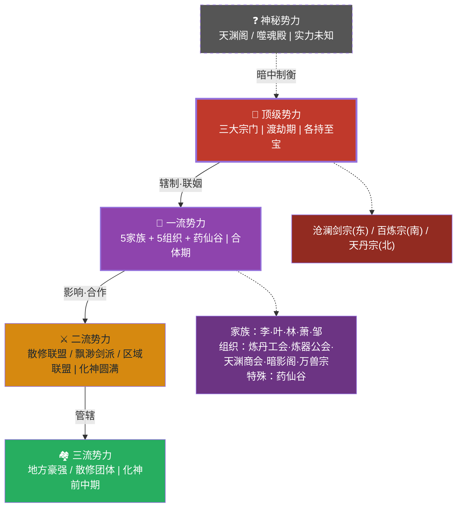

# 势力架构

## 势力层级总览

### 势力等级划分

| 等级 | 名称 | 顶级强者坐镇 | 代表势力 |
|------|------|--------------|----------|
| 顶级 | 霸主势力 | 渡劫期强者 | 三大宗门（各有一件天渊至宝） |
| 一流 | 强族/巨擘 | 合体期强者 | 五大家族、五大组织（炼丹师工会、炼器师工会、天渊商会、暗影阁、万兽宗）、药仙谷 |
| 二流 | 豪强/联盟 | 化神期圆满 | 散修联盟、飘渺剑派、各地区宗门联盟、中等家族 |
| 三流 | 地头蛇/散修 | 化神期前中期 | 地方豪强、散修团体首领 |
| 神秘 | 隐世/暗势力 | 未知 | 天渊阁、噬魂殿 |

**等级说明**：
- **渡劫期**：当代已知最高境界，据传当世有十余人达到，多为三大宗门太上长老或隐世强者
- **合体期**：一流势力顶尖战力，可小范围调动天地之力
- **化神期**：二流势力顶尖战力，可化身入神，掌控法则之力
- **注**：势力等级由最高战力决定，但整体势力实力还需考虑弟子数量、资源掌控等综合因素

#### 势力层级图

---

## 中央枢纽·天元城市群

**地位**：三大宗门及一流势力公认的中立商贸城市群，不属于任何势力，是大陆经济、文化、信息的核心枢纽

**组成架构**：

### 天元主城
- **定位**：商业核心、金融中心、信息枢纽
- **主导势力**：萧家、天渊商会、散修联盟
- **核心功能**：综合交易、拍卖会、信息交流、传送阵枢纽
- **标志性建筑**：聚宝阁、天元坊市、传送广场、天酒楼

### 丹城（卫星城）
- **定位**：丹药之都、药材交易中心、炼丹师圣地
- **主导势力**：炼丹师工会、天丹宗（间接影响）
- **核心功能**：丹药交易、炼丹师认证考核、炼丹大赛
- **标志性建筑**：九层丹塔、万药坊市、丹塔广场

### 天工城（卫星城）
- **定位**：法宝之都、矿石交易中心、炼器师圣地
- **主导势力**：炼器师工会、百炼宗（间接影响）
- **核心功能**：法宝交易、炼器师认证考核、炼器大赛
- **标志性建筑**：巨型炼器炉、天工坊市、铁炉广场

**城市规则**：
- 禁止在城内动手斗殴，违者由执法队严惩
- 城内交易需缴纳一定比例的税费
- 各大势力在城内设有驻点，但不得携带大量武装人员
- 三城之间有传送阵连接，往来便利

---

## 天渊至宝·传说神器

### 概述

上古时期，天渊大陆曾发生过一场浩劫，史称"天渊之战"。据传那场战争中，天地崩裂，大道紊乱，无数强者陨落。战后在天地规则的孕育下，诞生了四件超越凡俗的神器——**天渊至宝**。

这四件至宝每一件都蕴含着改天换地的力量，是天渊大陆最强大的存在。然而，上古大战中四件至宝皆受重创，至今仍有不同程度的残缺，威力无法完全恢复。即便如此，它们依然是冠绝大陆的存在，任何势力得到其中一件，都将拥有号令天下的实力。

### 四大天渊至宝

#### 第一·沧澜古剑（残缺）

- **所属**：沧澜剑宗
- **类型**：攻击至宝
- **外形**：一柄通体湛蓝的古剑，剑身有细微裂纹，剑格处缺了一角，剑气纵横时可引动天地变色
- **品级**：上古至宝（残缺状态约等于七品法器，完全状态下超越品级）
- **催动门槛**：必须渡劫期强者才能完全催动，合体期以下无法引动其真正威力
- **核心能力**：
  - **断法则**：一剑出可斩断天地法则，任何法则之力在其面前都不堪一击
  - **万剑臣服**：可凝聚天地剑意，压制一切剑道传承
  - **裂空斩**：剑光可撕裂空间，无视距离斩向目标
- **残缺影响**：剑灵沉睡，无法主动认主，只能被动接受契合者；每次使用会加速裂纹扩张；渡劫期以下使用时威力大打折扣，且有反噬风险
- **历史**：沧澜剑宗开宗祖师于天渊之战后所得，代代相传至今
- **传承方式**：血脉传承+剑意契合，只有剑道天赋绝伦且心境纯粹者才能承受剑意
- **镇宗之宝**：仅太上长老可使用，掌门需达到渡劫期才能驾驭

#### 第二·不灭神甲（残缺）

- **所属**：百炼宗
- **类型**：防御至宝（攻防兼备）
- **外形**：一副暗金色的甲胄，形态可变可隐，甲身有修复痕迹和未修复的破损，散发着古朴厚重的气息
- **品级**：上古至宝（残缺状态约等于七品法器，完全状态下超越品级）
- **催动门槛**：合体期以上可催动，化神期可部分激活防御
- **核心能力**：
  - **万劫不灭**：可承受远超自身承受极限的攻击而不碎
  - **八反甲**：受到攻击后可反弹八成伤害给攻击者，类似反甲效果
  - **攻防兼备**：防御的同时可凝聚铠甲之力进行攻击，攻击能力稍弱于纯粹攻击至宝
- **残缺影响**：防御有死角，无法完全覆盖；反弹上限降低，超极限攻击无法完全反弹；形态变化不完全
- **历史**：百炼宗始祖以天外陨铁和上古仙金所铸，融入战场陨落的炼器宗师残念
- **传承方式**：炼器师传承+百炼心法契合，需承受锻烧之苦
- **镇宗之宝**：宗主及太上长老可使用，对炼器师有亲和加成

#### 第三·天丹道炉（残缺）

- **所属**：天丹宗
- **类型**：毁灭至宝/熔炼至宝（非炼丹用）
- **外形**：一尊紫金色的丹炉，炉身刻有焚天纹和空间纹，炉盖处有缺口，平时看似普通丹炉，催动时散发恐怖气息
- **品级**：上古至宝（残缺状态约等于七品法器，完全状态下超越品级）
- **催动门槛**：合体期以上可催动基础能力，渡劫期可催动熔炼天地之力
- **核心能力**：
  - **熔炼天地**：可将天地万物吸入炉中熔炼，无论是生灵、法宝还是山川大地，皆可化为虚无
  - **焚天烈焰**：炉中蕴含焚天级烈焰，可焚烧一切有形之物
  - **空间囚笼**：可展开炉中空间，将敌人困于其中，再行熔炼
- **伪装能力**：平时可伪装成普通炼丹炉使用，炼制丹药时品质远超寻常丹炉，使人误以为其只是炼丹至宝
- **残缺影响**：熔炼范围有限，无法覆盖太大区域；空间囚笼持续时间有限；伪装能力有时会失效
- **历史**：天丹宗始祖于上古大战遗址所得，发现其真正用途后震惊不已，决定以炼丹为幌子隐藏其真正威力
- **传承方式**：灵魂契合，需以强大灵魂力为基础，与丹道悟性无关
- **镇宗之宝**：丹尊及太上长老可使用，是天丹宗真正的威慑力量，也是其守住基业的根本

#### 第四·混沌塔（残缺）

- **所属**：主角家族传承
- **类型**：本源至宝/储物修炼至宝
- **外形**：一座残缺的六层小塔，通体混沌色，每层都有神秘符文，塔身有明显残破痕迹，第七至第九层已完全消失，断口处可见混沌之力缓缓流淌。平时可缩小成指环或挂坠大小
- **品级**：上古至宝（残缺状态约等于七品法器，完全状态下超越品级）
- **完整度**：约四成（仅剩六层）
- **层数设定**：原本为九层神塔，天渊之战中第七至第九层彻底湮灭，先祖仅修复前六层。前五层无境界限制，可随时进入（但境界过低有危险，塔灵不建议）；第六层被上古封禁锁死，需天境（合体期）实力以法则之力突破封禁方可开启
- **核心能力**：
  - 第一层·混沌大厅：塔灵居所与无限储物空间
  - 第二层·混沌世界：独立小世界，灵气5-10倍，时间3-10倍加速
  - 第三层·万药园：灵药种植，生长加速2-5倍，炼丹天赋觉醒
  - 第四层·锻体域：恶劣环境锤炼肉身（罡风/炎焰/寒冰/雷电）
  - 第五层·魂海：魂力风暴打磨神魂，灵魂修炼强化
  - 第六层·天渊秘藏：四件至宝复原方法与终极秘密（需合体期开启）
- **来历**：陆家祖上于数千年前将其带到华夏，世代供奉于祠堂之中。先祖曾修复六层，但关于此塔的更多来历与使命，陆家世代知之甚少。父母为何离开、爷爷为何坚守祠堂……这些谜团，或许要等陆渊实力足够时才能解开
- **与主角关系**：主角家族宗祠中供奉的玉佩，正是这第四件天渊至宝的封印体。主角鲜血激活后，混沌塔跨越空间将他带到天渊大陆，与此塔灵魂绑定
- **残缺影响**：终极能力（回家之路）无法完全发挥，需集齐其他三件至宝才能修复第七至第九层

### 至宝关联

**太古传闻**：四件天渊至宝原本是一体，名为"天渊造化盘"，是天地初开时孕育的至宝。上古天渊之战中，天渊造化盘被击碎，化作四件至宝散落大陆。传说当四件至宝齐聚并修复后，可重铸天渊造化盘，届时将有能力打破天地桎梏，开辟飞升之路。

**制衡关系**：四件至宝各有所长又相互克制：
- 沧澜古剑主攻伐，可破万法，但催动门槛最高
- 不灭神甲主防御，八反伤人，攻防兼备
- 天丹道炉主毁灭，熔炼万物，威慑最大
- 混沌塔主未知，潜力无限，待主角发掘

**威力排序**（完整状态）：天丹道炉 > 沧澜古剑 > 不灭神甲 > 混沌塔（未知）

### 至宝现状

- **沧澜古剑**：完整度约七成，藏于沧澜剑宗禁地，由太上长老守护
- **不灭神甲**：完整度约六成，藏于百炼宗天工坊核心区域
- **天丹道炉**：完整度约五成，藏于天丹宗丹霄阁禁地，对外伪装为炼丹至宝
- **混沌塔**：完整度约四成，仅剩六层，第七至第九层已湮灭，下落不明，实为主角家族传承之物，已被主角激活

---

## 顶级势力·三大宗门

### 东域·沧澜剑宗

**宗门定位**：剑道霸主，大陆战力最强宗门

**实力**：掌门为合体期巅峰强者，太上长老团中有2位渡劫期隐世强者和3位合体期强者，另有数位合体期长老，是三大宗门中战力最雄厚的存在。门下弟子过万，精英弟子比例最高。

**特色**：以剑入道，追求极致，擅长海战、御剑飞行、水遁术

**地理位置**：东域·沧澜海岸

**宗门标识**：银色长剑纹章，弟子着青蓝色剑袍

**宗门架构**：

- **剑主**：掌门，宗门最高决策者，合体期巅峰，战力冠绝大陆
- **太上长老团**：5人，隐世强者（2位渡劫期，3位合体期），不问世事但关键时刻可出手，是宗门最强战力保障
- **长老团**：12人，各掌一方，元婴期以上，其中化神期占多数，战力强悍
- **执法堂**：维护宗门纪律，执行门规，由化神期长老坐镇
- **执事堂**：负责宗门日常事务管理
- **剑峰七座**：
  - 沧澜峰（主峰，掌门居所）
  - 断云峰（剑道研究）
  - 潮汐峰（水系功法）
  - 镇海峰（海兽防御）
  - 试炼峰（弟子考核）
  - 藏书峰（功法典籍）
  - 铸剑峰（飞剑锻造）

**弟子分级**：

- **内门弟子**：筑基期以上，核心传承者，可进入试炼秘境，精英比例高
- **外门弟子**：练气期，基础培养，需通过考核晋升内门
- **杂役弟子**：后勤服务，可通过努力获得修炼资源
- **亲传弟子**：剑主或长老亲授，宗门未来支柱，数量稀少

**核心功法**：《沧澜剑诀》（镇宗绝学，天级中阶）、《碧海潮生诀》（水系功法，地级中阶）

**特色武技**：沧澜七剑（地级中阶）、一剑破万法（地级上阶）、潮汐剑法（地级上阶）

**宗门驻地**：沧澜城（剑峰总坛）、镇海防线、剑冢、潮汐阁、铸剑坊

**附属势力**：林家（剑修家族）、沿海各小城池

**势力特点**：战力最雄厚，弟子整体素质最高，但财力相对薄弱，主要依赖宗门矿脉和海域资源

---

### 南域·百炼宗

**宗门定位**：体修与炼器双绝，大陆最均衡宗门

**实力**：掌门为合体期巅峰强者，太上长老团中有2位渡劫期隐世强者和2位合体期强者，另有数位合体期长老。门下弟子过万，整体战力与财力均处中游，是三大宗门中最均衡的存在。

**特色**：百炼成钢，内外兼修，擅长近身搏斗、锻造法宝、阵法布置

**地理位置**：南域·铁山平原

**宗门标识**：金色铁锤纹章，弟子着赤红色锻袍

**宗门架构**：

- **宗主**：掌门，宗门最高决策者，合体期巅峰
- **太上长老团**：4人，隐世强者（2位渡劫期，2位合体期），不问世事但关键时刻可出手
- **长老团**：12人，各掌一方，元婴期以上，炼器师与体修各占一半
- **天工坊**：炼器核心，分内坊和外坊，是大陆最大的法宝制造中心
- **演武堂**：体修核心，设有试炼设施和擂台
- **矿务堂**：负责矿脉开采和资源管理，掌控大陆最大灵石矿脉
- **阵法堂**：负责护宗大阵和阵法研究

**弟子分级**：

- **内门弟子**：筑基期以上，核心传承者，炼器师和体修各半
- **外门弟子**：练气期，基础培养
- **杂役弟子**：后勤服务，多为矿工和锻工出身
- **亲传弟子**：宗主或长老亲授，宗门未来支柱

**核心功法**：《百炼金身诀》（镇宗绝学，天级中阶）、《焚天锻体术》（火系功法，地级中阶）

**特色武技**：百炼拳（地级中阶）、铁山崩（地级上阶）、金刚不坏体（地级上阶）

**宗门驻地**：铁山城（铁山总坛）、天工坊、演武场、矿脉区、锻造殿、淬体池

**附属势力**：李家（体修家族）、邹家（炼器家族）、平原各小城池

**势力特点**：财力与战力相对均衡，掌控大陆最大灵石矿脉和法宝制造中心，是大陆经济的重要支柱

---

### 北域·天丹宗

**宗门定位**：炼丹与魂术圣地，大陆地位最高、最富有的宗门

**实力**：掌门为合体期巅峰强者，太上长老团中有2位渡劫期隐世强者和1位合体期强者，另有数位合体期长老，门下弟子过万。整体战力在三大宗门中略弱，但与另外两宗差距不大，且丹药收入惊人，经济实力冠绝大陆。

**特色**：以丹入道，以魂御丹，擅长驭兽、辨识草药、灵魂探查

**地理位置**：北域·万药山脉

**宗门标识**：紫色丹炉纹章，弟子着白色丹袍

**宗门架构**：

- **丹尊**：掌门，宗门最高决策者，合体期巅峰，大陆公认的第一炼丹师
- **太上长老团**：3人，隐世强者（2位渡劫期，1位合体期），不问世事但关键时刻可出手，是宗门顶级战力保障
- **长老团**：15人，各掌一方，元婴期以上，人数最多，炼丹师占多数，战力偏弱但丹术高超
- **丹药房**：炼丹核心，分不同等级丹房，是大陆最高级的炼丹场所
- **炼魂塔**：魂术修炼圣地，共九层，镇压上古魂兽残魂
- **百草园**：核心药园，种植珍稀灵草，规模最大，品种最全
- **驭兽峰**：驯养和研究妖兽，提供炼丹材料

**弟子分级**：

- **内门弟子**：筑基期以上，核心传承者，炼丹师和魂修占多数
- **外门弟子**：练气期，基础培养，数量最多
- **杂役弟子**：后勤服务，多为药农和驭兽师出身
- **亲传弟子**：丹尊或长老亲授，宗门未来支柱，数量稀少

**核心功法**：《天丹真经》（镇宗绝学，天级中阶）、《炼魂术》（魂术传承，地级中阶）

**特色技艺**：七品炼丹术、灵魂探查（地级中阶）、驭兽术（地级中阶）

**宗门驻地**：天丹城（万药总坛·丹霄阁）、百草园、炼魂塔、北荒边界、丹药房、驭兽峰

**附属势力**：叶家（炼丹家族）、山间凡人村落、丹城炼丹师公会

**势力特点**：战力略弱于另外两宗，但差距不大，且财力与地位最高。表面上是掌控大陆绝大部分药材和丹药供给，各大势力都需仰仗其丹药；实际上，天丹道炉才是天丹宗真正的威慑力量——那是一件足以熔炼天地万物的毁灭至宝，无人敢轻易触怒天丹宗。这也是天丹宗地位超然的根本原因

---

## 一流势力·强族与巨擘

**总体说明**：一流势力是大陆的中坚力量，每一家都有一位或多位合体期强者坐镇，整体实力雄厚，在某一领域拥有绝对话语权。

### 五大修仙家族

**李家**
- **家主**：未知
- **实力**：家族合体期强者坐镇，化神期长老数人，是南域仅次于百炼宗的势力
- **特色**：体修传承家族，擅长拳脚功夫，族中男子多修炼体术
- **地理位置**：铁山平原北部
- **家族标识**：金色猛虎纹章
- **核心功法**：《猛虎下山诀》（地级中阶）
- **家族架构**：家主、大长老、各房长老、核心子弟、普通子弟
- **与百炼宗关系**：世代联姻，族中强者可担任百炼宗客卿

**叶家**
- **家主**：未知
- **实力**：家族合体期强者坐镇，炼丹师众多，是北域仅次于天丹宗的势力
- **特色**：炼丹传承家族，拥有多处私人药园，独立性强
- **地理位置**：万药山脉深处
- **家族标识**：绿色药草纹章
- **核心功法**：《百草心经》（地级中阶）
- **家族架构**：家主、大长老、各房长老、核心子弟、普通子弟
- **与天丹宗关系**：不依附，但与药仙谷有合作

**林家**
- **家主**：未知
- **实力**：家族合体期强者坐镇，剑修众多，是东域仅次于沧澜剑宗的势力
- **特色**：剑修家族，剑法自成一派，祖上有人曾在沧澜剑宗担任长老
- **地理位置**：沧澜海岸内陆
- **家族标识**：青色剑穗纹章
- **核心功法**：《青锋剑诀》（地级中阶）
- **家族架构**：家主、大长老、各房长老、核心子弟、普通子弟
- **与沧澜剑宗关系**：剑法同源而异流，负责部分区域巡逻

**萧家**
- **家主**：未知
- **实力**：家族合体期强者坐镇，商业实力雄厚，是天元城市群的实际掌控者之一
- **特色**：综合性家族，弟子可自由选择修炼方向，商业巨头
- **地理位置**：天元城市群·天元主城
- **家族标识**：金色商印纹章
- **核心功法**：《万象诀》（兼容多种修炼方向，地级中阶）
- **家族架构**：家主、大长老、各房长老、核心子弟、普通子弟
- **地位**：天元主城主要管理者之一，掌控商会联盟，与各大势力保持良好关系

**邹家**
- **家主**：未知
- **实力**：家族合体期强者坐镇，炼器师众多，是南域炼器世家的翘楚
- **特色**：炼器家族，擅长锻造防御类法宝，为大陆公认的防具世家
- **地理位置**：铁山平原南部
- **家族标识**：银色盾牌纹章
- **核心功法**：《金刚铸体术》（地级中阶）
- **家族架构**：家主、大长老、各房长老、核心子弟、普通子弟
- **与百炼宗关系**：合作密切，为宗门提供优质兵器

---

### 五大独立组织

**炼丹师工会**
- **会长**：未知
- **实力**：合体期强者坐镇，大陆炼丹师聚集组织，势力庞大
- **特色**：制定炼丹师等级标准，举办炼丹大赛，药材交易中心
- **地理位置**：天元城市群·丹城，占据整座城池核心区域
- **工会标识**：金色丹炉纹章
- **核心功能**：
  - 炼丹师等级认证与考核
  - 炼丹技法交流与传承
  - 药材交易与分配
  - 举办大陆炼丹大赛（每五年一次）
- **与天丹宗关系**：竞争与合作并存，互不统属，但受天丹宗影响最深

**炼器师工会**
- **会长**：未知
- **实力**：合体期强者坐镇，大陆炼器师聚集组织，势力庞大
- **特色**：制定炼器师等级标准，举办炼器大赛，矿石交易中心
- **地理位置**：天元城市群·天工城，占据整座城池核心区域
- **工会标识**：金色铁锤纹章
- **核心功能**：
  - 炼器师等级认证与考核
  - 炼器技法交流与传承
  - 矿石交易与分配
  - 举办大陆炼器大赛（每五年一次）
- **与百炼宗关系**：竞争与合作并存，互不统属，但受百炼宗影响最深

**天渊商会**
- **会长**：未知（神秘莫测）
- **实力**：大陆最大商会，富可敌国，背后有天境强者（疑似渡劫期）撑腰
- **特色**：垄断大陆主要贸易，经营灵石、丹药、法宝、材料等所有修炼资源
- **地理位置**：天元城市群·天元主城中心，总部为聚宝阁
- **商会标识**：金色元宝纹章
- **核心功能**：
  - 大陆最大拍卖行（聚宝阁）
  - 跨区域贸易网络
  - 情报收集与贩卖
  - 提供修炼资源借贷
- **地位**：中立势力，与各大势力均有合作，无人敢轻易招惹

**暗影阁**
- **阁主**：未知（神秘莫测）
- **实力**：传说中有合体期杀手坐镇，大陆最神秘的杀手组织，接单杀人，从不失手
- **特色**：只要付得起代价，任何人都可以成为目标
- **地理位置**：隐藏在暗处，总部未知
- **组织标识**：黑色骷髅纹章
- **核心功能**：
  - 暗杀服务
  - 情报收集
  - 赏金任务
- **规则**：不接针对三大宗门核心人物的单子，不杀无辜
- **地位**：令人闻风丧胆的存在，各大势力对其既忌惮又利用

**万兽宗**
- **宗主**：未知
- **实力**：合体期强者坐镇，是大陆最强大的驭兽宗门
- **特色**：以驯兽为主，人和宠兽配合战斗，拥有大量妖兽
- **地理位置**：万药山脉与铁山平原交界处的万兽城
- **宗门标识**：金色兽爪纹章
- **核心功法**：《驭兽心经》（地级中阶）、《万兽合一诀》（地级上阶）
- **宗门架构**：宗主、长老团、驯兽堂、兽兵营、炼兽阁
- **驯兽体系**：
  - 凡兽驯养：凡境弟子驯养凡兽作为坐骑和战斗伙伴
  - 灵兽契约：地境弟子可与灵兽签订契约，人兽合一
  - 地兽臣服：天境强者可降服地兽，建立兽群
- **特色武技**：人兽合击技、万兽大阵、兽魂附体
- **与天丹宗关系**：提供妖兽材料，换取丹药
- **地位**：一流势力中战力独特的存在，靠人兽配合战斗著称

### 特殊一流势力·药仙谷

**药仙谷**
- **谷主**：未知（神秘莫测，传说为上古炼丹大能后裔）
- **实力**：合体期强者坐镇，独立炼丹圣地，传说有上古传承，历史比天丹宗更悠久
- **特色**：种植大量珍稀古药，拥有独特的培育方法，部分药材为谷中独有；凭上古传承与独有药材守住基业，连天丹宗也不敢轻视
- **地理位置**：万药山脉深处秘境入口处
- **谷中标识**：紫色仙草纹章
- **核心功能**：珍稀药材培育、炼丹术研究、传承上古丹道
- **与天丹宗关系**：神秘独立，极少与外界接触，偶有药材交易

---

## 二流势力·豪强与联盟

**总体说明**：二流势力占据一方地域，通常由一位或多位化神期圆满强者坐镇，在区域内有较大影响力。

### 区域宗门联盟

**东域联盟**
- **盟主**：由沧澜海岸周边中型宗门家主轮流担任
- **成员**：沧澜海岸周边各中小型宗门
- **职能**：协调区域事务，共同抵御海兽侵袭
- **实力**：盟主为化神期圆满强者

**南域联盟**
- **盟主**：由铁山平原周边中型宗门家主轮流担任
- **成员**：铁山平原周边各中小型宗门
- **职能**：协调矿脉分配，维护区域秩序
- **实力**：盟主为化神期圆满强者

**北域联盟**
- **盟主**：由万药山脉周边中型宗门家主轮流担任
- **成员**：万药山脉周边各中小型宗门
- **职能**：协调药材采集，共同抵御妖兽
- **实力**：盟主为化神期圆满强者

---

### 特色势力

**飘渺剑派**
- **掌门**：未知（神秘莫测）
- **实力**：化神期圆满强者坐镇，神秘剑修门派，剑法飘逸难以捉摸
- **特色**：剑法注重速度和灵活性，与沧澜剑宗风格迥异
- **地理位置**：沧澜海岸深处孤岛（飘渺岛）
- **门派标识**：白色雾剑纹章
- **核心功法**：《飘渺无影剑》（地级中阶）
- **与沧澜剑宗关系**：同为剑修门派，但风格迥异，极少往来

**散修联盟**
- **盟主**：未知
- **实力**：化神期圆满强者坐镇（名义盟主，实际势力松散），人数众多
- **特色**：为散修提供信息、资源交换、庇护等服务
- **地理位置**：天元城市群·天元主城，总部设在天元主城南区
- **联盟标识**：灰色流云纹章
- **核心功能**：散修信息交流、资源交换平台、散修庇护所、组织散修共同行动

---

## 三流势力·地头蛇与散修

**总体说明**：三流势力割据一隅，由化神期前中期强者坐镇，实力有限但在地盘内有一定影响力。

### 地方豪强

- **各城城主**：凡人城池的管理者，多为筑基期或金丹期修士
- **矿主/药农头领**：掌控小型矿脉或药田的势力
- **山寨/匪帮**：占据险要之地的武装团体

### 散修团体

- **散修客栈**：散修聚集和交易的场所
- **探险队**：组队探索秘境或危险区域的散修团体
- **雇佣兵**：接受委托执行任务的散修

---

## 神秘势力·隐世与暗势力

**总体说明**：神秘势力隐藏在暗处，实力深不可测，其存在和实力仅为传说，无人知晓全貌。

### 天渊阁

**性质**：最神秘的隐世势力

**实力**：未知，据传有渡劫期强者坐镇

**传说**：
- 与天渊深渊有关，可能是上古时期守护封印的组织
- 成员极少，但个个都是顶尖强者
- 只在大陆面临重大危机时才会现身

**已知信息**：几乎没有，只存在于传说中

### 噬魂殿

**性质**：邪恶的魂修组织

**实力**：未知，据传有合体期或更高强者

**传说**：
- 以吞噬他人灵魂来增强自身
- 在大陆各处制造惨案，收集灵魂
- 与天丹宗的炼魂塔有某种渊源

**现状**：被三大宗门联合打压，转入地下活动，暗中发展

### 第四天渊至宝持有者

**性质**：未知的第四方势力

**实力**：未知

**传说**：
- 天渊轮回镜早已择主，只是主人隐匿于世
- 第四位至宝持有者可能是上古大能转世，也可能是某个古老家族的传承者
- 主角家族供奉的神秘挂坠/戒指，很可能是天渊轮回镜的残片或封印体

**已知信息**：几乎没有，但主角的出现可能预示着这位神秘存在即将浮出水面

---

## 城池体系

### 概述

天渊大陆是一个以修炼为主流的世界，不存在专门的凡人城池。即使是最边远的小城，也有修仙者存在，只是修为水平有所差异。城池按修仙者水平和影响力分为三个层级：

### 核心城

**核心城**是大陆的政治、经济、文化中心，汇聚了最强大的修仙势力和最顶尖的修仙者。

**天元主城**
- **地位**：大陆第一城，天元城市群核心
- **主导势力**：萧家、天渊商会、散修联盟
- **修仙水平**：合体期强者常驻，地境修士众多
- **核心功能**：综合交易、拍卖会、信息交流、传送阵枢纽
- **标志性建筑**：聚宝阁、天元坊市、传送广场、天酒楼

**天丹城**
- **地位**：天丹宗主城，大陆炼丹圣地
- **主导势力**：天丹宗
- **修仙水平**：渡劫期强者坐镇，地境修士众多
- **核心功能**：炼丹传承、药材培育、灵魂修炼
- **标志性建筑**：丹霄阁、百草园、炼魂塔

**沧澜城**
- **地位**：沧澜剑宗主城，大陆剑道圣地
- **主导势力**：沧澜剑宗
- **修仙水平**：渡劫期强者坐镇，地境修士众多
- **核心功能**：剑道传承、海域防御、飞剑锻造
- **标志性建筑**：沧澜剑峰、断云峰、铸剑坊

**铁山城**
- **地位**：百炼宗主城，大陆炼器圣地
- **主导势力**：百炼宗
- **修仙水平**：渡劫期强者坐镇，地境修士众多
- **核心功能**：炼器传承、矿脉管理、体修训练
- **标志性建筑**：天工坊、铁山总坛、淬体池

### 区域中心城池

**区域中心城池**是各区域的中心城市，由一流势力或二流势力掌控，是区域内的经济和军事枢纽。

**丹城**（天元城市群卫星城）
- **地位**：丹药之都、炼丹师圣地
- **主导势力**：炼丹师工会
- **修仙水平**：合体期强者坐镇，地境修士不少
- **核心功能**：丹药交易、炼丹师认证考核、炼丹大赛
- **标志性建筑**：九层丹塔、万药坊市、丹塔广场

**天工城**（天元城市群卫星城）
- **地位**：法宝之都、炼器师圣地
- **主导势力**：炼器师工会
- **修仙水平**：合体期强者坐镇，地境修士不少
- **核心功能**：法宝交易、炼器师认证考核、炼器大赛
- **标志性建筑**：天工塔、矿石坊市、天工广场

**梅城**（万药山脉区域中心城池）
- **地位**：北域炼丹重镇
- **主导势力**：叶家
- **修仙水平**：合体期强者坐镇
- **核心功能**：药材种植、丹药炼制

**东江城**（东域区域中心城池）
- **地位**：东域剑修重镇
- **主导势力**：林家
- **修仙水平**：合体期强者坐镇
- **核心功能**：剑法传承、区域巡逻

**潮海城**（南域区域中心城池）
- **地位**：南域体修重镇
- **主导势力**：李家
- **修仙水平**：合体期强者坐镇
- **核心功能**：体术传承、矿脉开采

**南海城**（南域区域中心城池）
- **地位**：南域炼器重镇
- **主导势力**：邹家
- **修仙水平**：合体期强者坐镇
- **核心功能**：防具锻造、矿石加工

**万兽城**（万药山脉与铁山平原交界）
- **地位**：大陆驭兽重镇
- **主导势力**：万兽宗
- **修仙水平**：合体期强者坐镇
- **核心功能**：驯兽传承、妖兽交易

### 边远小城

**边远小城**分布在大陆各处，由三流势力或散修团体掌控，修仙者水平较低但依然存在。

**特点**：
- 城主多为化神期前中期或金丹期修士
- 城内有少量修士和大量凡人居民
- 凡人居民也有机会接触修炼，但资源匮乏
- 是大陆修炼体系的底层基础

**典型小城**：
- **渔阳城**：东域沿海小城，以捕鱼和海兽材料交易为主
- **石矿城**：南域铁山平原边缘小城，以矿石开采为主
- **药谷城**：北域万药山脉边缘小城，以药材采集为主
- **沙城**：西北北荒沙漠边缘小城，以沙漠探险和贸易为主

### 修仙王朝

**大炎王朝**
- **皇帝**：未知（修为至少元婴期以上）
- **疆域**：覆盖天元城周边及铁山平原部分区域
- **实力**：以修仙者为主，拥有一支修仙军队
- **与宗门势力关系**：依附于三大宗门，负责管理区域内的城池和凡人事务
- **特色**：王朝高层均为修仙者，是修仙势力在凡人世界的延伸
- **地位**：三流势力级别，但因地理位置重要而受到重视

---

## 势力活动

### 定期赛事

> **背景**：修仙世界弱肉强食、打打杀杀才是正道。大陆表面的"和平"**只维持在最顶层**——三大宗门顶层战力（渡劫期太上长老）彼此威慑、维持"冷战式"平衡；但中下层、中小宗门、散修、边缘地带竞争激烈、热战不断。固定赛事并非"唯一对抗窗口"（中下层天天在打），而是超大宗门把部分竞争**规矩化、舞台化**的产物——是年轻一代公开扬名、登正统榜单的常规渠道，也是各势力"不撕破脸地较量"的泄压阀。赛事与《榜单与赛事体系》中的天榜/地榜/天骄榜/天丹榜/地丹榜直接挂钩。

**城域大比**
- **举办方**：区域中心城城主府（如东江城）
- **地点**：区域中心城演武场（渔阳城等边远小城无此级别赛事，只有本地小规模武比）
- **周期**：每年或每两年一次
- **内容**：城市本地修士/佣兵团切磋，选拔城市代表
- **对应榜单**：城市战力榜（仅区域中心城及以上设此榜；渔阳城等边远小城无正式榜单，本地武比只攒声望/选代表）
- **奖励**：城主府资源配额、声望

**宗门大比**
- **举办方**：三大宗门轮流主办
- **地点**：天元城市群·天元主城中心广场
- **周期**：每十年一次
- **内容**：各宗门弟子切磋交流，展示实力
- **奖励**：功法、丹药、法宝等

**炼丹大赛**
- **举办方**：炼丹师工会
- **地点**：天元城市群·天丹城万药大会会场
- **周期**：每五年一次
- **内容**：炼丹师比拼炼丹技艺
- **奖励**：珍稀药材、丹方、炼丹炉等

**炼器大赛**
- **举办方**：炼器师工会
- **地点**：天元城市群·天工城
- **周期**：每五年一次
- **内容**：炼器师比拼炼器技艺
- **奖励**：珍稀矿石、炼器图谱、法宝等

**东域丹盟大会**
- **举办方**：东江城丹阁 / 炼丹师工会东域分会
- **地点**：东江城（东域区域中心城池）
- **周期**：每三年一次
- **内容**：东域丹师比拼炼丹技艺，设青年组
- **对应榜单**：地丹榜 / 丹道新锐榜
- **奖励**：珍稀药材、丹方、东域丹师工会席位

**东域天骄会武**
- **举办方**：东域联盟
- **地点**：东域核心城池（轮办）
- **周期**：每三年一次
- **内容**：东域同代修士比武，选拔东域天骄
- **对应榜单**：东域天骄榜 / 地榜
- **奖励**：东域资源配额、被大势力招揽资格

**天骄战**
- **举办方**：三大宗门 + 天元主城
- **地点**：天元城市群·天元主城
- **周期**：每三年一次
- **内容**：大陆同代天骄巅峰对决
- **对应榜单**：大陆天骄榜
- **奖励**：大陆级声望、宗门/商会招揽、珍稀传承

**拍卖会**
- **举办方**：天渊商会（聚宝阁）
- **地点**：天元城市群·天元主城聚宝阁
- **周期**：每月一次小型拍卖会，每年一次大型拍卖会
- **内容**：拍卖各种珍稀物品
- **特色**：大陆最大的拍卖会，常有意想不到的珍品出现

### 秘境探索

**万药秘境**
- **位置**：万药山脉深处
- **开启**：每百年开启一次，需特定令牌进入
- **内容**：生长珍稀古药，有强大守护妖兽，可能获得炼丹传承

**剑冢秘境**
- **位置**：沧澜剑宗剑冢深处
- **开启**：每年开启一次，仅限宗门弟子进入
- **内容**：蕴含上古剑意传承，有历代剑修的遗留

**矿山秘境**
- **位置**：百炼宗铁脊山脉矿脉深处
- **开启**：不定期开启，需宗门批准
- **内容**：有珍稀矿藏和古代遗迹，可能获得炼器传承

**天渊秘境**
- **位置**：天元城市群·天元主城地下深处，传说连接天渊
- **开启**：未知，可能与特定条件有关
- **内容**：蕴含浓郁灵气，有神秘的传承，危险未知

---

## 势力关系

### 联盟与对抗

**三大宗门**：三足鼎立，总体和平共处，定期交流，但在资源和名声上存在竞争。三大宗门顶尖战力差距不大，各有2位渡劫期太上长老坐镇，但在合体期数量和整体风格上各有侧重：沧澜剑宗战力最雄厚，天丹宗地位最高最富有，百炼宗最为均衡。沧澜剑宗虽强，但需仰仗天丹宗丹药和百炼宗法宝；天丹宗虽富，但战力略弱需借天丹道炉威慑；百炼宗则居中调停，左右逢源。三者形成微妙的制衡关系。

**家族与宗门**：李家-百炼宗、林家-沧澜剑宗有联姻合作关系；叶家-天丹宗保持距离但有药材交易

**工会与宗门**：炼丹师工会-天丹宗、炼器师工会-百炼宗既有竞争也有合作

**商会与各方**：天渊商会与各大势力均有合作，保持中立

**暗影阁**：与各大势力均有业务往来，但不参与势力纷争

### 利益纠葛

**资源争夺**：灵石矿脉、灵药产地、秘境探索权的归属时常引发争端

**名声竞争**：宗门大比、炼丹大赛、炼器大赛是展示实力的舞台

**面子之争**：各势力之间的排名和声望至关重要

**地下交易**：暗影阁的暗杀服务、天渊商会的情报贩卖

### 制衡机制

**丹药控制**：天丹宗掌控大陆绝大部分丹药供给，各大势力都需仰仗其丹药，这是天丹宗地位超然的根本原因

**法宝供给**：百炼宗掌控大陆最大灵石矿脉和法宝制造中心，是大陆经济的重要支柱

**武力威慑**：沧澜剑宗战力最雄厚，是维护大陆秩序的主要力量，任何势力都不敢轻易挑衅

**经济制裁**：天渊商会垄断大陆贸易，可通过贸易制裁对任何势力施加压力

**情报监控**：暗影阁掌握大陆最全面的情报网络，可随时揭露任何势力的秘密

### 历史恩怨

**上古恩怨**：三大宗门建立之初曾有过冲突，后达成和平协议

**家族恩怨**：部分家族之间存在历史遗留问题

**天丹宗秘闻**：天丹宗的外来祖先来历成谜，是大陆未解之谜，据传他们来自天渊大陆之外的世界

**噬魂殿**：被三大宗门联合打压的邪恶组织，与天丹宗炼魂塔的渊源

---

## 势力更迭规则

**宗门兴衰**：
- 宗门实力取决于掌门和核心强者的实力
- 弟子培养是宗门长远发展的关键
- 资源掌控是宗门兴衰的基础

**家族起落**：
- 家族兴衰取决于家族强者的数量和实力
- 联姻和合作可提升家族地位
- 资源传承是家族延续的保障

**新势力诞生**：
- 散修中出现强者可建立新势力
- 原有势力分裂可产生新势力
- 发现新资源或秘境可催生新势力

**势力覆灭**：
- 核心强者陨落可导致势力衰败
- 资源枯竭可导致势力消亡
- 触犯众怒可被联合围剿
